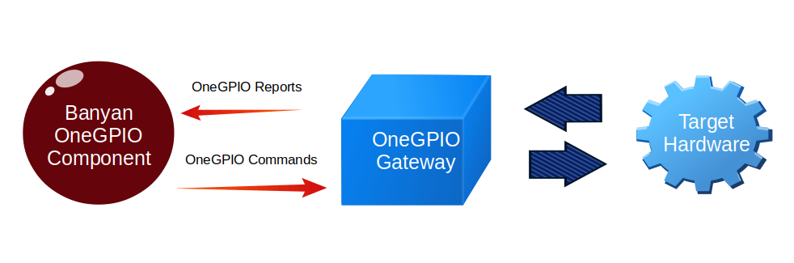

# Introduction To The *OneGPIO* Message API

Unlike traditional GPIO libraries that use a hardware-specific *method call API* interface,
OneGPIO uses a ***Banyan Messaging API*** interface. [The OneGPIO
Specification](https://github.com/MrYsLab/python_banyan/blob/master/projects/OneGPIO/message_specification/OneGPIO.pdf) 
provides Banyan message templates for all OneGPIO commands
and reports. The OneGPIO Specification is a hardware and computer language independent 
abstraction of GPIO operations. 

A ***OneGPIO Command Message*** is published by a OneGPIO Application Component to transmit 
GPIO command information to the target hardware.

A ***OneGPIO Report Message*** is published by a OneGPIO Gateway, after receiving report data
from the target hardware.
 Because the Gateway is translating native report messages into OneGPIO messages, 
 it has the freedom to add
additional data to the report message, such as a timestamp.

A command message contains the keyword ***command,*** and a
report contains the keyword ***report***

In general, a GPIO pin must have its mode set before use. 
For example, to set a pin to digital output mode, you would use the following
message template:

|      GPIO Operation      |              OneGPIO Message             |
|:------------------------: |:-------------------------------: |
| Set Pin To Digital Output Mode      | {"command": "set_mode_digital_output", "pin": PIN, "tag":”TAG” } | 

When setting a pin mode, you have the option to name or ***tag*** the pin. 
This helps to improve code readability when interacting with that pin.
You may reference the pin using either its tag or pin number interchangeably.
However, if you wish to use a tag, the ***tag must be set when the pin mode is set.***

The *pin tag* to *pin number* mapping is automatically maintained within
the OneGPIO Gateways.

To illustrate let's populate the 'set_mode_digital_output' command message
to set pin 4 as a **digital output** pin and tag the pin with **"green_led**.

**{'command': 'set_mode_digital_output', 'pin': 4, 'tag': 'green_led' }**

Notice that ***pin*** is an integer and not a string.

All OneGPIO message *keys* are strings. Within the OneGPIO message specification, if a *value* is *not*
within quotes, then it is specified as an integer. Otherwise, it is specified as a string.

The OneGpio command to set the state of a digital output pin is:

|      GPIO Operation      |              OneGPIO Message             |
|:------------------------:|:-------------------------------:|
| Set Digital Output Pin State      | {"command": "digital_write", "pin": PIN, "tag": "TAG", "value": VALUE} |

Now that the pin mode has been set with a tag, we can set the green LED to *on* with the following
message: 

**{'command': 'digital_write', 'tag': 'green_led', 'value': 1 }**

We do not need to specify the pin number since we specified
a tag when we set the pin mode. Also notice, that the value is an integer
and not a string.

If a pin tag is specified when setting the pin mode, you may use either the
tag or pin number when referencing the pin in a command.

To port a OneGPIO application to a different hardware platform, you need only
change the pin number for the chosen
hardware platform. This can easily be implemented using command line arguments
when designing the component.  

 
 
Copyright (C) 2017-2020 Alan Yorinks All Rights Reserved

