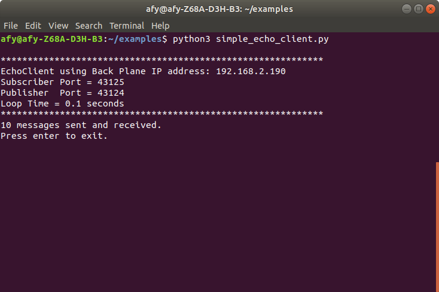

# An Echo Server-Client Example

In this section, we will build a simple echo server-client application
 using the Python Banyan Framework.

First, we will run the demo and then examine the code for both the server
and client Banyan components.

## Running The Example

The Backplane is installed as an executable module when Python Banyan is installed.
By typing 'backplane' in a command or terminal window, the Backplane will start.

The components, simple_echo_server.py, and simple_echo_client.py are invoked
from the command line using the typical method to start a Python program.

The following screenshots were taken on a Linux computer running Python 3,
and that is why the *python3* command is displayed. You may
run these examples on Linux, Windows, Mac or, Raspberry using either
Python 2 or Python 3. Simply substitute your system's specific python command
to run the examples.

### First, start the Backplane in a terminal window.

```
backplane
```


### Start the server in a second terminal window.

Go to the directory that contains simple_echo_server.py
and type:

```
python3 simple_echo_server.py
```


The base class prints an informational header to the console.

### Start the client in a third terminal window.
Go to the directory that contains simple_echo_client.py
and type:

```
python3 simple_echo_client.py
```

A standard Banyan header is printed to the client's console, and the client begins sending its messages.

When the client completes sending all of its messages, 
the client's console will indicate the number of messages sent and received.



The console for the server will display all of the message numbers it received


## Examining The Server Code

The server's role is to simply wait for the "echo" topic messages
 to arrive and then to extract the message's payload and publish a "reply" topic message.


Let's look at the code below:

Lines 20 through 22 import the component's required modules.

Line 22 illustrates the standard syntax used to import the BanyanBase base class.

Line 25 declares the EchoServer component class. It inherits from the BanyanBase base class.


```
     1	"""
     2	simple_echo_server.py
     3
     4	 Copyright (c) 2016-2019 Alan Yorinks All right reserved.
     5
     6	 Python Banyan is free software; you can redistribute it and/or
     7	 modify it under the terms of the GNU AFFERO GENERAL PUBLIC LICENSE
     8	 Version 3 as published by the Free Software Foundation; either
     9	 or (at your option) any later version.
    10	 This library is distributed in the hope that it will be useful,
    11	 but WITHOUT ANY WARRANTY; without even the implied warranty of
    12	 MERCHANTABILITY or FITNESS FOR A PARTICULAR PURPOSE.  See the GNU
    13	 General Public License for more details.
    14
    15	 You should have received a copy of the GNU AFFERO GENERAL PUBLIC LICENSE
    16	 along with this library; if not, write to the Free Software
    17	 Foundation, Inc., 51 Franklin St, Fifth Floor, Boston, MA  02110-1301  USA
    18
    19	"""
    20	import sys
    21
    22	from python_banyan.banyan_base import BanyanBase
    23
    24
    25	class EchoServer(BanyanBase):
    26	    """
    27	    This class is a simple Banyan echo server
    28
    29	    """
```

Lines 31 through 44 define the [\__init__](../examples_intro/#95_init__) method.


When inheriting from another class, the parent class must be initialized.

Line 34 initializes the parent and sets the parent's
 [*process_name*](../examples_intro/#process_name) parameter. The process_name is printed to the console when the component is
 first invoked. All other default values are accepted as is.

Line 37 calls the BanyanBase method [*set_subscriber_topic*](../examples_intro/#set_subscriber_topic) to subscribe to 'echo' messages.

Line 41 calls the BanyanBase method [*receive_loop*](../examples_intro/#receive_loop) to wait for incoming messages.

Line 42 through 44 traps a Control-C entered by the user. The inherited BanyanBase [*clean_up*](../examples_intro/#clean_up) method
is called to close the ZeroMQ connections. The program is then exited.

```
    31	    def __init__(self, ):
    32
    33	        # initialize the parent
    34	        super(EchoServer, self).__init__(process_name='EchoServer')
    35
    36	        # subscribe to receive 'echo' messages from the client
    37	        self.set_subscriber_topic('echo')
    38
    39	        # wait for messages to arrive
    40	        try:
    41	            self.receive_loop()
    42	        except KeyboardInterrupt:
    43	            self.clean_up()
    44	            sys.exit(0)
```

Lines 46 through 55 overrides the base class [*incoming_message_process*](../examples_intro/#incoming_message_processing) method.
Whenever a message is received by the *receive_loop*, it calls *incoming_message_processing* to process the message.

The *incoming_message_processing* method requires two parameters, a
topic string and a payload. Both the topic and payload are decoded within the receive_loop, so they
are ready for use by the *incoming_message_processing* method.

Line 53 republishes the payload just received, setting the topic to 'reply,' The message number
of the received message is then printed to the console.
```
    46	    def incoming_message_processing(self, topic, payload):
    47	        """
    48	        Process incoming messages from the client
    49	        :param topic: message topic
    50	        :param payload: message payload
    51	        :return:
    52	        """
    53	        self.publish_payload(payload, 'reply')
    54	        print('Message number:', payload['message_number'])
    55
```

Lines 61 through 62 create a function to instantiate the EchoServer class.
This function is added so that we can install our component as an executable
file in our system if we desire to do so. Installing Components as executable modules
is [explained in a later section.](../example7/#example7)


Lines 57 through 62 use a [standard Python construct](https://docs.python.org/3/library/__main__.html) to
call the instantiation function.
```
    57	def echo_server():
    58	    EchoServer()
    59
    60
    61	if __name__ == '__main__':
    62	    echo_server()


```

## Examining The Client Code

The role of the client is to publish 'echo' messages. It maintains a message sequencing number,
incorporated into the payload. Shortly after being invoked, the client
sends out the first 'echo' message. It then waits for a 'reply' message from the server before
publishing the next message.

The messaging sequencing number is decremented after each message is published.
When the sequencing number reaches zero, the final message is published, and the client halts.

The code for the client is very similar to that of the [server](#examining-the-code).
In this section, the major differences between the client and server are highlighted.

Line 38 calls the inherited BanyanBase method *set_subscriber_topic* to subscribe to
'reply' messages.

Line 41 establishes
instance variables to keep track of the current message sequencing number and
the total messages sent. Both are initialized to a value of 10.

Line 44 publishes
an "echo" message with a payload containing the current message number.

Line 48 calls the component's receive_loop, and the client waits for the next
incoming 'reply' message.

```
     1	"""
     2	simple_echo_client.py
     3
     4	 Copyright (c) 2016-2019 Alan Yorinks All right reserved.
     5
     6	 Python Banyan is free software; you can redistribute it and/or
     7	 modify it under the terms of the GNU AFFERO GENERAL PUBLIC LICENSE
     8	 Version 3 as published by the Free Software Foundation; either
     9	 or (at your option) any later version.
    10	 This library is distributed in the hope that it will be useful,
    11	 but WITHOUT ANY WARRANTY; without even the implied warranty of
    12	 MERCHANTABILITY or FITNESS FOR A PARTICULAR PURPOSE.  See the GNU
    13	 General Public License for more details.
    14
    15	 You should have received a copy of the GNU AFFERO GENERAL PUBLIC LICENSE
    16	 along with this library; if not, write to the Free Software
    17	 Foundation, Inc., 51 Franklin St, Fifth Floor, Boston, MA  02110-1301  USA
    18
    19	"""
    20
    21	import sys
    22
    23	from python_banyan.banyan_base import BanyanBase
    24
    25
    26	class EchoClient(BanyanBase):
    27	    """
    28	    This is a simple echo client derived from the BanyanBase class. It sends out a series of messages and expects an
    29	    echo reply from the server.
    30	    """
    31
    32	    def __init__(self):
    33
    34	        # initialize the parent
    35	        super(EchoClient, self).__init__(process_name='EchoClient')
    36
    37	        # accept banyan messages with the topic of reply
    38	        self.set_subscriber_topic('reply')
    39
    40	        # sequence number of messages and total number of messages to send
    41	        self.message_number = self.number_of_messages = 10
    42
    43	        # send the first message - make sure that the server is already started
    44	        self.publish_payload({'message_number': self.message_number}, 'echo')
    45
    46	        # get the reply messages
    47	        try:
    48	            self.receive_loop()
    49	        except KeyboardInterrupt:
    50	            self.clean_up()
    51	            sys.exit(0)

```

Line 53 is the *incoming_message_processing* method.

Line 62 tests the sequencing value of the 'reply' message. When the sequencing value is set to 0,
the final message was sent and received.
Lines 63 through 66 print
the total number of messages sent and received to the console,
and the user is asked to press *enter* to exit the program.

Lines 69 through 71 process non-terminating 'reply' messages.
The message number is decremented by 1, and the next 'echo' message is then built
and published.

```
    53	    def incoming_message_processing(self, topic, payload):
    54	        """
    55	        Process incoming messages received from the echo client
    56	        :param topic: Message Topic string
    57	        :param payload: Message Data
    58	        :return:
    59	        """
    60
    61	        # When a message is received and its number is zero, finish up.
    62	        if payload['message_number'] == 0:
    63	            print(str(self.number_of_messages) + ' messages sent and received. ')
    64	            input('Press enter to exit.')
    65	            self.clean_up()
    66	            sys.exit(0)
    67	        # bump the message number and send the message out
    68	        else:
    69	            self.message_number -= 1
    70	            if self.message_number >= 0:
    71	                self.publish_payload({'message_number': self.message_number}, 'echo')
    72
    73
    74	def echo_client():
    75	    EchoClient()
    76
    77
    78	if __name__ == '__main__':
    79	    echo_client()

```
<br>
<br>
Copyright (C) 2017-2020 Alan Yorinks All Rights Reserved


