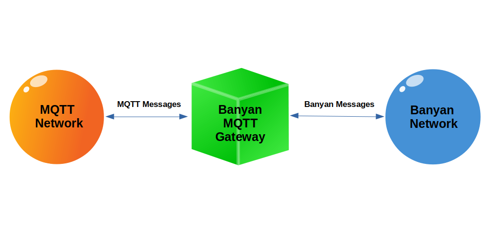

# Connecting Banyan Applications To MQTT

 

The [MQTT Gateway](https://github.com/MrYsLab/python_banyan/blob/master/python_banyan/utils/mqtt_gateway/mqtt_gateway.py)
 is a Banyan component that can subscribe to receive MQTT messages
from the MQTT network, and then forward those messages to the Banyan network.
It also can subscribe to receive Banyan messages, and then forward those to the MQTT network.

The MQTT Gateway is installed as a command-line executable when
Python Banyan is installed. To invoke the MQTT Gateway, open a terminal
window and type:

__mgw__

There are several optional command-line parameters
available in mgw. For the examples that follow, the default values are accepted

Here is a list of all the optional parameters.

```
mgw -h

usage: mqtt_gateway.py [-h] [-a MQTT_IP_ADDRESS] [-b BACK_PLANE_IP_ADDRESS]
                       [-d MQTT_PORT] [-e BANYAN_PUB_TOPIC]
                       [-g BANYAN_SUB_TOPICS [BANYAN_SUB_TOPICS ...]]
                       [-i MQTT_PUB_TOPIC]
                       [-j MQTT_SUB_TOPICS [MQTT_SUB_TOPICS ...]]
                       [-n PROCESS_NAME] [-p PUBLISHER_PORT]
                       [-s SUBSCRIBER_PORT] [-t LOOP_TIME]

optional arguments:
  -h, --help            show this help message and exit
  -a MQTT_IP_ADDRESS    IP address of mqtt broker
  -b BACK_PLANE_IP_ADDRESS
                        None or IP address used by Back Plane
  -d MQTT_PORT          MQTT Port Number
  -e BANYAN_PUB_TOPIC   Topic for messages to MQTT
  -g BANYAN_SUB_TOPICS [BANYAN_SUB_TOPICS ...]
                        Banyan topics space delimited: topic1 topic2 topic3
  -i MQTT_PUB_TOPIC     Topic for messages sent to MQTT
  -j MQTT_SUB_TOPICS [MQTT_SUB_TOPICS ...]
                        MQTT topics space delimited: topic1 topic2 topic3
  -n PROCESS_NAME       Set process name in banner
  -p PUBLISHER_PORT     Publisher IP port
  -s SUBSCRIBER_PORT    Subscriber IP port
  -t LOOP_TIME          Event Loop Timer in seconds
  
```
When the MQTT Gateway is invoked, it automatically connects to both the Banyan Backplane and to the MQTT Broker.

Before running the following examples, make sure that you
have a [mosquitto broker](https://mosquitto.org/) and a [Python Banyan
Backplane](../examples_intro/#starting-the-backplane) running.


## Example 1: Pure MQTT Publish And Subscribe
This example will publish a simple MQTT message to be received by a simple
MQTT subscriber.

### MQTT Publisher
Below is the code for a simple [MQTT publisher](https://github.com/MrYsLab/python_banyan/blob/master/examples/mqtt_gateway/pub.py)
 that publishes a single message and exits.

```
import json

import paho.mqtt.client as mqtt

# This is a simple MQTT publisher example.
# It connects to an MQTT broker, builds a payload and
# then publishes the message with a topic of "mqtt_network".

my_client = mqtt.Client()
my_client.connect("localhost", 1883, 60)
z = {'from_mqtt_client': 'hello'}

payload = json.dumps(z).encode()
my_client.publish("mqtt_network", payload)
my_client.disconnect()
```

### MQTT Subscriber

The [MQTT subscriber](https://github.com/MrYsLab/python_banyan/blob/master/examples/mqtt_gateway/sub.py)
 that connects to an MQTT broker,
and subscribes to 2 topics. The **mqtt_network** messages are for messages originated
on the MQTT network. The **from_banyan** messages are messages that were originated on the
Banyan network. For this first example, no messages are originated from the Banyan network.

```
import paho.mqtt.client as mqtt
import json


# This is a simple MQTT subscriber example.
# It connects to an MQTT broker and
# subscribes to "mqtt_network" messages
# and prints a message when one is received.

def on_connect(client, userdata, flags, rc):
    print("Connected with result code " + str(rc))
    client.subscribe("mqtt_network")
    client.subscribe("from_banyan")


def on_message(client, userdata, msg):
    m = msg.payload.decode()
    x = json.loads(m)
    print(x)


my_client = mqtt.Client()
my_client.connect("localhost", 1883, 60)

my_client.on_connect = on_connect
my_client.on_message = on_message

my_client.loop_forever()

```

First, we start the subscriber, and then the publisher. The subscriber prints
any messages it receives. Here is the subscriber console output after
running the publisher:
```
python3 sub.py
Connected with result code 0
{'from_mqtt_client': 'hello'}

```
## Example 2: Publishing a Banyan Message To the MQTT Network

Start the MQTT Gateway by opening a terminal window and typing:
mgw

The Gateway connects to the Python Backplane and to the MQTT broker

```
$ mgw

************************************************************
MqttGateway using Back Plane IP address: 192.168.2.189
Subscriber Port = 43125
Publisher  Port = 43124
Loop Time = 0.1 seconds
************************************************************
MQTT Gateway Connected to MQTT localhost:1883 with result code 0.

```

If it not already running, start the MQTT subscriber, sub.py.

To generate a message from Banyan to the MQTT network, we will use a Banyan component called
[bpub.py:](https://github.com/MrYsLab/python_banyan/blob/master/examples/mqtt_gateway/bpub.py)

```
from python_banyan.banyan_base import BanyanBase


class Bpub(BanyanBase):
    """
    This class will publish a message for the MqttGateway to forward to the MQTT network.
    """

    def __init__(self):
        """
        This is constructor for the Bpub class

        """

        # initialize the base class
        super(Bpub, self).__init__(process_name='Bpub')

        # send a message to the MqttGateway
        self.publish_payload({'from_banyan': 'hello_mqtt_world'}, 'to_mqtt')

        # exit
        self.clean_up()


b = Bpub()
```
If we then start the *bpub.py* and look at the MQTT Subscriber's output, we see the message
from Banyan was sent out over MQTT and received by the MQTT subscriber:

```
~/PycharmProjects/python_banyan$ python3 sub.py

Connected with result code 0
{'from_banyan': 'hello_mqtt_world'}
```

The Gateway received a Banyan message, translated it to an MQTT message, published
this message on the MQTT network, and the translated message
was received by the MQTT subscriber.

## Example 3: Publishing an MQTT Message To the Banyan Network

In this example, an MQTT message will be published by pub.py.
The MQTT Gateway will receive this message, and it will then translate
this message to a Banyan message and publish
the message to the Banyan network.

A Banyan component called [__bsub.py__](https://github.com/MrYsLab/python_banyan/blob/master/examples/mqtt_gateway/bsub.py) 
subscribes to receive the translated message and will publish it to the console.

To run this example, start the MQTT Gateway as we did in
[Example 2.](../example10/#example-2-publishing-a-banyan-message-to-the-mqtt-network)

Start bsub.py:

```
python3 bsub.py
```

```
from python_banyan.banyan_base import BanyanBase


class Bsub(BanyanBase):
    """
    This class will receive any MQTT messages intercepted by MqttGateway
    """

    def __init__(self):
        """
        This is constructor for the Bpub class

        """

        # initialize the base class
        super(Bsub, self).__init__(process_name='Bsub')

        # subscribe to receive MQTT messages processed
        # by the MqttGateway
        self.set_subscriber_topic('from_mqtt')

        # start the receive_loop
        self.receive_loop()

    def incoming_message_processing(self, topic, payload):
        print(topic, payload)


b = Bsub()

```
And finally, start the MQTT publisher pub.py

```
python3 pub.py
```

Looking at the console for bsub.py, we that the message was received from the MQTT
network and received by the Banyan network.

```
python3 bsub.py

************************************************************
Bsub using Back Plane IP address: 192.168.2.189
Subscriber Port = 43125
Publisher  Port = 43124
Loop Time = 0.1 seconds
************************************************************
from_mqtt {'from_mqtt_client': 'hello'}
```

<br>
<br>
Copyright (C) 2017-2020 Alan Yorinks All Rights Reserved

