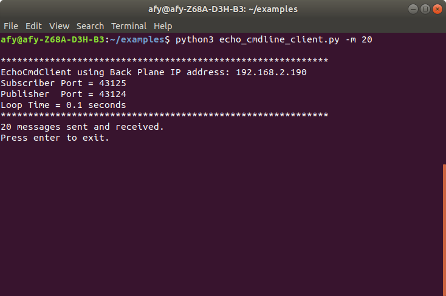

# Modifying The Simple Echo Client

Being able to set a component's parameters using command-line options
allows the user to change a component's behavior.

To demonstrate, we will use the existing simple echo client. The
code will be modified to allow the user to do the following via the command line:

* Specify the Backplane IP address
* Specify the publisher and subscriber port numbers
* Specify the number of messages to send to the server
* Specify a process name to display on the banner
* Specify the loop time

This example allows the user to specify, none, one, or any combination
of parameters, allowing maximum flexibility.

To process user-specified command-line parameters, we will
use the [argparse library](https://docs.python.org/3/library/argparse.html).

A code comparison will be provided for the modified code.
Any new code that is required is also shown for the feature.

Once we modify the code, we will be able to print a help screen to the console by merely
invoking the program with
a *-h* command-line option. A list of all command-line options will be displayed
for the user to choose from.


## Adding the Necessary Imports

We will import the argparse package as well as the signal package
to the original file. Argparse allows us to create the command
line arguments. The signal enables us to trap and process a Control-C
entered by the user.

```
    22	import argparse
    23	import signal
```

## Modifying The Component Class

Line 29 declares the name for our modified client.

Lines 31 through 56 provide usage information.

Lines 59 defines the \__init__ method, and it accepts a dictionary
of parameters, called *kwargs*. The kwargs dictionary is populated
near the end of the program.

Lines 88 through 92 dereference the kwargs values and passes the values to the parent class.

The rest of the class definition is unchanged.

```
    29	class EchoCmdClient(BanyanBase):
    30	    """
    31	    This is an echo client that will allow the user
    32	    to specify command line arguments to change the default behavior
    33	    of the client.
    34
    35	    It sends out a series of messages and expects an
    36	    echo reply from the server. When it completes, press enter, and it
    37	    will send a message to the server so that it also quits
    38
    39	    To use: 1. Start the backplane.
    40	            2. Start the server.
    41	            3. Start this client.
    42
    43	    usage: echo_cmdline_client.py [-h] [-b BACK_PLANE_IP_ADDRESS]
    44	                      [-m NUMBER_OF_MESSAGES] [-n PROCESS_NAME]
    45	                      [-p PUBLISHER_PORT] [-s SUBSCRIBER_PORT] [-t LOOP_TIME]
    46
    47	    optional arguments:
    48	      -h, --help            show this help message and exit
    49	      -b BACK_PLANE_IP_ADDRESS
    50	                            None or IP address used by Back Plane
    51	      -m NUMBER_OF_MESSAGES
    52	                            Number of messages to publish
    53	      -n PROCESS_NAME       Set process name in banner
    54	      -p PUBLISHER_PORT     Publisher IP port
    55	      -s SUBSCRIBER_PORT    Subscriber IP port
    56	      -t LOOP_TIME          Event Loop Timer in seconds
    57	    """
    58
    59	    def __init__(self, **kwargs):
    60
    61	        """
    62	        kwargs is a dictionary that will contain the following keys:
    63
    64	        :param back_plane_ip_address: banyan_base back_planeIP Address -
    65	                                    if not specified, it will be set to the
    66	                                    local computer
    67	        :param subscriber_port: banyan_base back plane subscriber port.
    68	               This must match that of the banyan_base backplane
    69	        :param publisher_port: banyan_base back plane publisher port.
    70	                               This must match that of the
    71	                               banyan_base backplane.
    72	        :param number_of_messages: number of message to transmit
    73	        :param process_name: Component identifier
    74	        :param loop_time: receive loop sleep time
    75
    76	        """
    77
    78	        # initialize the parent
    79	        super(EchoCmdClient, self).__init__(back_plane_ip_address=kwargs['back_plane_ip_address'],
    80	                                            subscriber_port=kwargs['subscriber_port'],
    81	                                            publisher_port=kwargs['publisher_port'],
    82	                                            process_name=kwargs['process_name'],
    83	                                            loop_time=kwargs['loop_time'])
    84
    85	        # accept banyan messages with the topic of reply
    86	        self.set_subscriber_topic('reply')
    87
    88	        # sequence number of messages
    89	        self.message_number = kwargs['number_of_messages']
    90
    91	        # number of messages to send
    92	        self.number_of_messages = kwargs['number_of_messages']
    93
    94	        # send the first message - make sure that the server is already started
    95	        self.publish_payload({'message_number': self.message_number}, 'echo')
    96
    97	        # get the reply messages
    98	        try:
    99	            self.receive_loop()
   100	        except KeyboardInterrupt:
   101	            self.clean_up()
   102	            sys.exit(0)

```

### Adding A Startup Function After The Class Definition

Here, we create a function that follows the class definition. This
function, called echo_cmdline_client(), will instantiate the class
and parse any command-line options that the user may have specified.

This function is contained within lines 125 to 168.

Line 126 creates an instance of an ArgumentParser.

Lines 129 through 144 create the command-line options and adds them
to the argument parser.

Line 146 creates a variable called *args* and populates args with
the values for all of the command-line options.

Lines 148 through 155 retrieve the option values using the defaults
or the values provided by the user. The options
are then added to a Python dictionary called kw_options.

Line 158 instantiates the class, passing in the kw_options.

Lines 161 through 164 add a signal handler to trap a user entered Control-C.

Line 172 calls the *echo_cmdline_client* function on line 125 to invoke the client.


```
   125	def echo_cmdline_client():
   126	    parser = argparse.ArgumentParser()
   127	    # allow user to bypass the IP address auto-discovery.
   128	    # This is necessary if the component resides on a computer
   129	    # other than the computing running the backplane.
   130	    parser.add_argument("-b", dest="back_plane_ip_address", default="None",
   131	                        help="None or IP address used by Back Plane")
   132	    parser.add_argument("-m", dest="number_of_messages", default="10",
   133	                        help="Number of messages to publish")
   134	    # allow the user to specify a name for the component and have it shown on the console banner.
   135	    # modify the default process name to one you wish to see on the banner.
   136	    # change the default in the derived class to set the name
   137	    parser.add_argument("-n", dest="process_name", default="EchoCmdClient",
   138	                        help="Set process name in banner")
   139	    parser.add_argument("-p", dest="publisher_port", default='43124',
   140	                        help="Publisher IP port")
   141	    parser.add_argument("-s", dest="subscriber_port", default='43125',
   142	                        help="Subscriber IP port")
   143	    parser.add_argument("-t", dest="loop_time", default=".1",
   144	                        help="Event Loop Timer in seconds")
   145	
   146	    args = parser.parse_args()
   147	
   148	    if args.back_plane_ip_address == 'None':
   149	        args.back_plane_ip_address = None
   150	    kw_options = {'back_plane_ip_address': args.back_plane_ip_address,
   151	                  'number_of_messages': int(args.number_of_messages),
   152	                  'publisher_port': args.publisher_port,
   153	                  'subscriber_port': args.subscriber_port,
   154	                  'process_name': args.process_name,
   155	                  'loop_time': float(args.loop_time)}
   156	
   157	    # replace with the name of your class
   158	    EchoCmdClient(**kw_options)
   159	
   160	
   161	# signal handler function called when Control-C occurs
   162	def signal_handler(sig, frame):
   163	    raise KeyboardInterrupt
   164	
   165	
   166	# listen for SIGINT
   167	signal.signal(signal.SIGINT, signal_handler)
   168	signal.signal(signal.SIGTERM, signal_handler)
   169	
   170	
   171	if __name__ == '__main__':
   172	    echo_cmdline_client()
```

## Using The -m Option
We can now specify the number of messages the client produces while accepting the other parameters' default values.

Ensuring that the backplane and server are already running, we can start
the new client, asking it to produce 20 messages.

```
python3 echo_cmdline_client.py -m 20
```

This command will create 20 messages.

Here is what the client console displays after running this command.



<br>
<br>
Copyright (C) 2017-2020 Alan Yorinks All Rights Reserved


