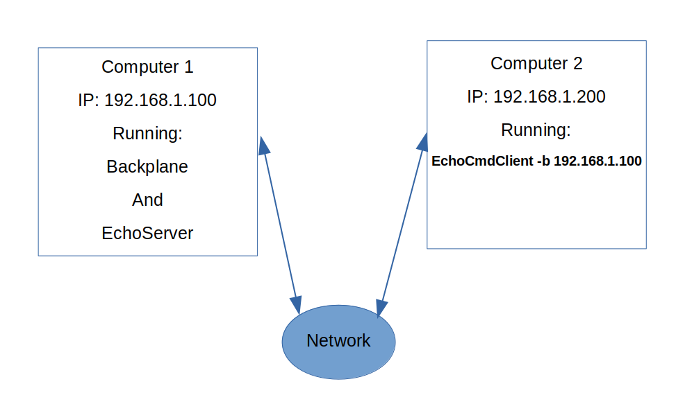

# Distributing Banyan Application Components Across Multiple Computers

Distributing the components of a Banyan application across multiple computers
is a simple matter of copying the component's Python
code to the desired computer, and then pointing the component to the IP address and ports
of the running backplane.


For example, let's say we have 2 computers on a network, one with an IP address of
192.168.1.100 and the other with an address of 192.168.2.200.

 

We can distribute the application across two computers. In this scenario, the ***backplane***
and the ***echo server*** from [example 1](../example1/#the-server) run on computer 1.
The modified
echo client from [example 2](../example2/#example2) runs on computer 2. We need to specify
the backplane address by using
the -b 192.168.1.100 option to point to the backplane on computer 1:

```
python3 echo_cmdline_client.py -b 192.168.1.100
```

That's it - no configuration files, no recoding, just a simple command-line option!

The client will publish 10 messages, but we can easily modify that with the
 -m command-line option:

```
python3 echo_cmdline_client.py -b 192.168.1.100 -m 20
```

<br>
<br>
Copyright (C) 2017-2020 Alan Yorinks All Rights Reserved
