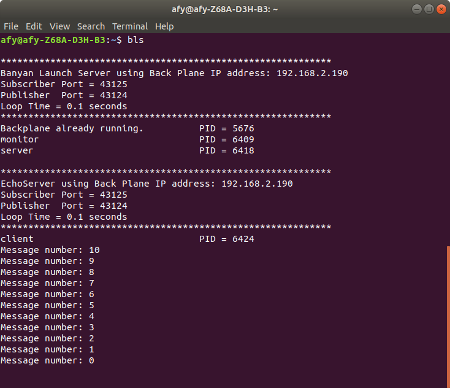
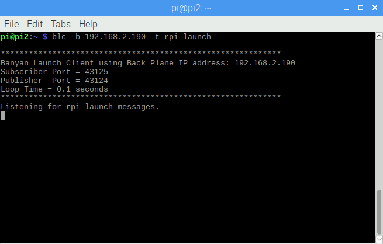
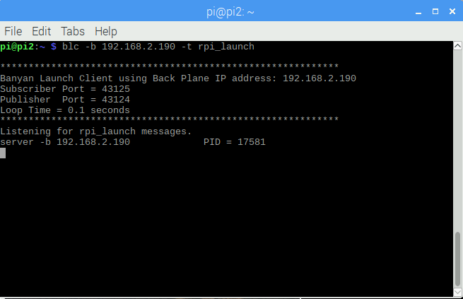
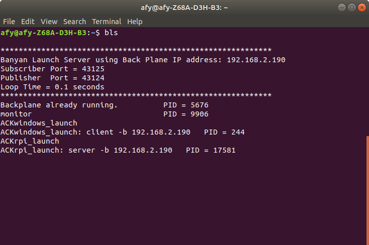
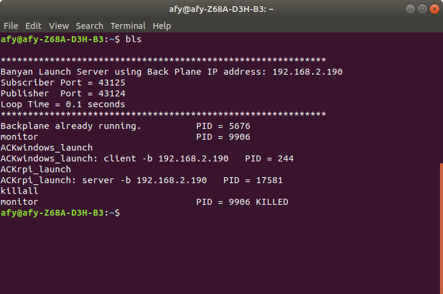

# The Python Banyan Launcher

Launching a Banyan application often involves launching multiple
individual Banyan components. The Python Banyan launcher
simplifies the launch process by allowing you to start all the components
from a single console command.

This source code for the Banyan launcher may be found on [GitHub.](https://github.com/MrYsLab/python_banyan/tree/master/python_banyan/utils/banyan_launcher)


**NOTE:** For Linux, Mac, and Raspberry PI users, the launcher requires **xterm** to be installed on your system.

***Xterm is not required for Windows, so Windows users can skip to 
[Launching Components.](../example8/#launching-components)***

## Testing For Xterm

To determine if xterm is installed on your computer, simply open a terminal window and type:

```
xterm
```

You should see an xterm window similar to the one below appear. If an xterm window does not appear,
then you will need to install xterm.


## Installing Xterm For Raspberry Pi or Debian Based Linux

In a terminal window type:
```
sudo apt-get install xterm
```

## Installing Xterm For Mac

Please refer to [these instructions.](https://support.apple.com/en-us/ht201341)

## Launching Components

To demonstrate the launcher's ue\se,  we will
launch the [monitor](../example5), the
[simple echo server](../example1/#the-server), and
[command-line echo client](../example2). 
To demonstrate the launcher's use, we will launch the [monitor](../example5), 
[simple echo server](../example1/#the-server),
[command-line echo client](../example2). 

All three were installed as executable components in a
 [previous section](../example7) of this document.
 
 

 Launch instructions are specified by creating a comma delimited text file
 called the ***launch descriptor file***. Let's examine the *launch descriptor file* in detail.

## The Launch Descriptor File

For each Python Banyan component we wish to launch, a corresponding launch description entry is placed in the *launch descriptor file*.

Let's look at the contents of [*launch.csv*](https://github.com/MrYsLab/python_banyan/blob/master/python_banyan/utils/banyan_launcher/launch.csv)
, the comma delimited text file we will use to launch
our components.

```
command_string,spawn,topic,append_bp_address,auto_restart,wait
monitor,yes,local,no,no,0
server,yes,local,no,yes,0
client,yes,local,no,no,0
```

The first line of the file contains the descriptor for each of the entry fields.

```
command_string,spawn,topic,append_bp_address,auto_restart,wait

```
**command_string** - this field is the command-line command used to execute the component. 
For this example, the launcher will start the monitor, the server, and client installed as executable modules,
as [described earlier](../example7).

Note that the launcher will execute any command string we enter, so for example,
if the file *simple_echo_server.py* is in the */home/bob_files/demo* directory, we could specify the command
as

```
python /home/bob_files/demo/simple_echo_server.py,yes,local,no,yes,0
```

**spawn** - this field determines if the command will be executed in its own
 terminal window. If **yes**, a new window
will be opened, and all component console output will appear in this window. If this field is set to **no**,
 the component will be spawned within the common launcher terminal window, and all console output will be placed
 in that window. There are screenshots below to demonstrate both cases.

**topic** - if a component is to be run on the local machine, the topic must be set to ***local***. If you wish
to launch a component on a remote computer, then the *topic* must be set to something other than ***local***. Note
that the *topic* mentioned here is for the launcher's purposes and does not affect the application.
Remote launching will be demonstrated [in the Banyan Launch Client section](#the-banyan-launch-client).

**append_bp_address** - this field is used mainly when launching components on a remote computer.
If set to ***yes***, the backplane IP address is appended to the command string with a
***-b option***. The address is the IP address of the local computer. For example, if the backplane IP address is 
used is 192.168.1.100, 
the descriptor entry for the client component was set as follows:
```
client,yes,remote1,yes,no,0
```
The command string sent to the remote computer would be:
```
client -b 192.168.1.100
```

When the component is launched on the remote computer, it will automatically connect to the backplane.
The -b option is used, assuming that the component was built using [command-line options](../example2).

**auto_restart** - if this field is set to *yes*, and
the component crashes, it will
automatically be restarted.

**wait** - this is the time in seconds to wait before executing the next line in the script.

# The Banyan Launch Server

The Banyan Launch Server (**bls**) is the name of the Banyan application that
reads the *Launch Descriptor* file and launches the components specified by that file.
The Banyan Launch Server is automatically installed as an executable when you installed
Python Banyan. 

When invoking bls, if no launch descriptor file is specified using the -f command-line option,
then bls will assume that a file called *launch.csv* is being used.

Make sure you have a copy of *launch.csv* in your current working directory.

Let's execute bls:


We see a standard Banyan header, followed by a list of the components launched with their process IDs(PID).

The launch server first checks to see if a backplane is currently running and, if not, will launch one before
proceeding.

It then launches each of the components specified in the launch descriptor file. Because we specified *spawn* for
each component, a terminal window is invoked for each component.


If we modify launcher.csv to set the server's spawn parameter to ***no***, then the server's output is displayed
in the bls console window.
```
command_string,spawn,topic,append_bp_address,auto_restart,wait
monitor,yes,local,no,no,0
server,no,local,no,yes,0
client,yes,local,no,no,0

```




## The Auto-Restart Feature

We specified auto-restart for the server in the launch descriptor file. Let's close the server window
opened by *bls* and see what happens.


When ***bls*** detects that the server process died, it indicates this in
the ***bls*** console and then relaunches the server. A new PID
is generated for the relaunch.

If we kill the client, which does not have auto restart enabled, then we see the "DIED" notification.


## The Log File

Anytime a process dies, it is not only noted on the screen, but an entry is placed in
 the banyan log file.
The log file, called banyan_launcher.log, is automatically generated and placed
in the user's home directory.

# The Banyan Launch Client

The Banyan Launch Client (**blc**) is invoked on the
remote computer to launch components on the remote computer with a command on the local computer.

To demonstrate how to launch components remotely, we will distribute the components, as
shown below:


The Ubuntu computer will run bls and the backplane. Its IP address is 192.168.2.190

The Windows 10 computer will run blc and the client. Its IP address is 192.168.180

The Raspberry Pi computer will run blc and the server. Its IP address is 192.168.189

All we need to do is install the components on their respective computers
and modify the launch configuration file. Then we start bls,
in the case of this example, on the Ubuntu computer and blc on the remote computers,
Windows 10, and the Raspberry Pi.

**NOTE:** The configuration file only resides on the computer that runs ***bls***.
It will send all the launch information to the remote computers.
The remote computers will then manage the applications, including auto-restart if specified.

## Modified Launch Descriptor For Remote Launching
```
command_string,spawn,topic,append_bp_address,auto_restart,wait
monitor,yes,local,no,no,0
server,yes,rpi_launch,yes,yes,0
client,yes,windows_launch,yes,no,0
```

The lines for the server and client have been modified to set the append_bp_address field to yes.
 Also, a unique topic string is created for each remote computer.  For the echo server that will run on the Raspberry Pi,
the topic string **rpi_launch** was chosen, and for the Windows machine running the echo client,
**windows_launch** was chosen.

## Invoking The Banyan Launch Client

Ensure that you have installed Python Banyan on your computer, which will automatically
install the Banyan launcher programs.

The **blc** application requires 2 command-line arguments to be supplied on the command-line.
 If the required arguments are not supplied, then ***blc*** will exit with an error message.

 The first required command-line argument
is the application's backplane IP address. The second required field is the topic string
that the remote computer subscribes to receive its launch instructions.

For the Windows machine, **blc** is started with the following command:
```
blc -b 192.168.2.190 -t windows_launch
```

And for the Raspberry Pi:
```
blc -b 192.168.2.190 -t rpi_launch
```

You may start **bls** and the **blc** instances in any order.

When **bls** starts, it will publish Banyan messages with the topics specified in the
Launch Configuration File. The payload will contain the details of the launch for the component.

Using the monitor, we can capture the messages being sent by **bls,** as shown below.


After starting ***bls,*** we see the following:


The backplane and monitor have been started on the local computer.

We next start ***blc*** on the Raspberry Pi computer and see the following:



The Raspberry Pi is awaiting the launch message from ***bls***.

When we start ***blc*** on the Windows computer, we see a similar screen:


When the launch messages are received on the remote computers, we see the following:




After ***blc*** launches a program on the remote computer, 
the program's name and process ID (PID), assigned by the remote machine, are displayed.

The local instance of ***bls*** reflects the handshake between the local and remote computers:



The PIDs used by the remote computers are shown on the screen.

# Killing The Application

The Banyan Launch Kill (**blk**) utility allows you to kill all the
local and remote components by issuing a command on  the local computer. The blk utility is installed
automatically when python-banyan.

To use blk, open a terminal or command window and type:

```
blk
```


When we do this, we see the following on the local computer and remote computers,
showing that all processes were killed successfully.




<br>
<br>
Copyright (C) 2017-2020 Alan Yorinks All Rights Reserved


