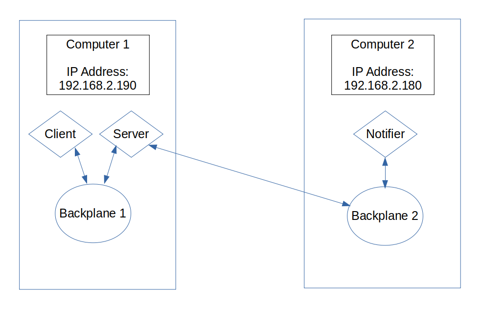
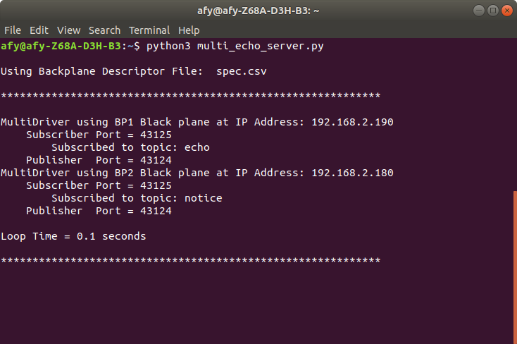
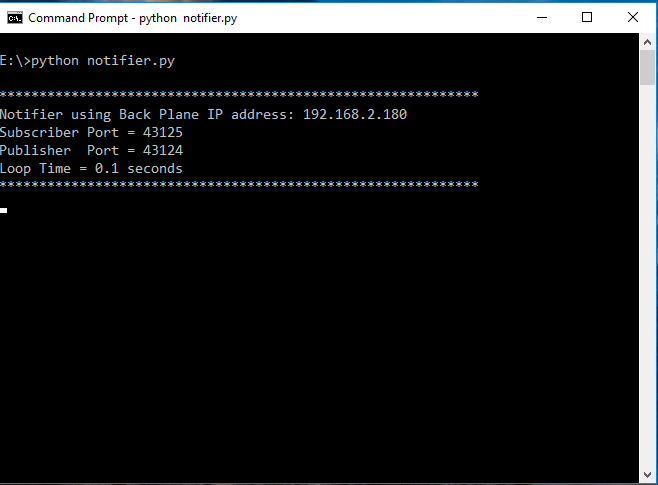
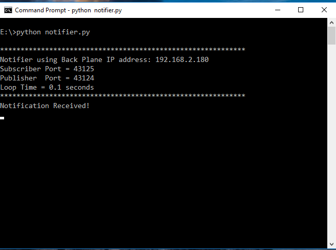
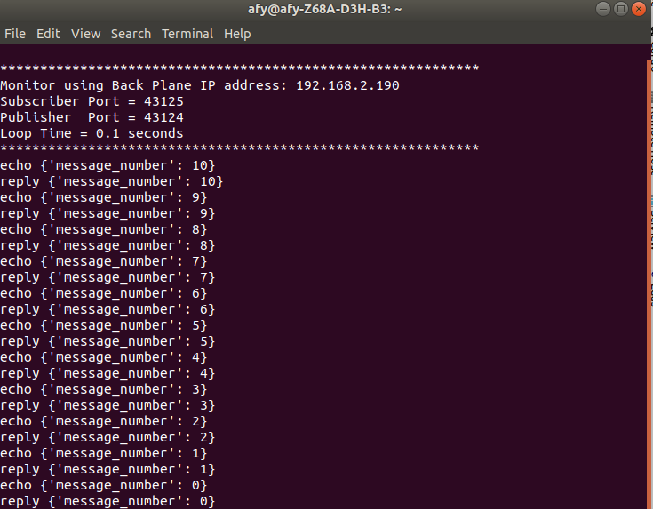
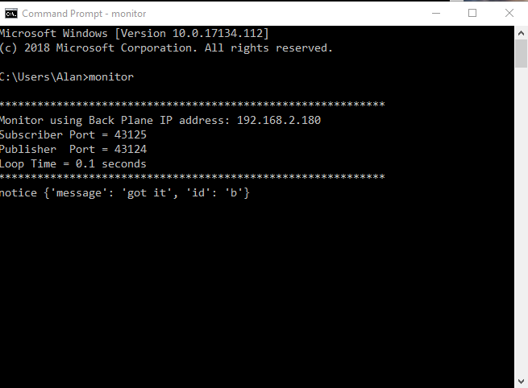

# Multi-Backplane Applications

For the vast majority of Banyan applications, a single backplane is all that is needed to
handle all the
application's messaging needs. When using a single backplane configuration, there is no need to manually perform
message routing, since all components automatically connect to a [common backplane.](../examples_intro/#the-banyan-backplane)

There are occasions, however, where you might like to design your component so that it
 can to communicate with more than one backplane. Some possible
 scenarios for this configuration would be to provide message load balancing or a better
 separation of operational concerns. To support these types of configurations,
 a new base class, [***BanyanBaseMulti***,](https://github.com/MrYsLab/python_banyan/blob/master/python_banyan/banyan_base_multi/banyan_base_multi.py)
 is required.
 

# The ***Banyan Base Multi*** Base Class

In many ways, the ***BanyanBaseMulti***
 base class
is similar to the [***BanyanBase***](../examples_intro/#python-banyan-base-classes)
 class, but there is one significant difference. A *BanyanBaseMulti* component requires that
a backplane routing table be provided at initialization. This table is known as the *routing specification file*.

Note: *BanyanBase* and *BanyanBaseMulti* components may communicate with each other without restriction.
No coding changes or message format changes are required.


## The Routing Specification File For ***BanyanBaseMulti***

Every BanyanBaseMulti component requires access to a unique comma-delimited
 routing specification file. The name and path of this file
is a required component input parameter.

Let's explore the format of the specification file.

The header and first line of a routing specification file is:

```
backplane_name,ip_address,subscriber_port,subscriber_topic,publisher_port

```

The ***backplane_name*** field is a unique ID string given to each of the connected backplanes.
The IDs are used
to de-reference publisher and subscriber connections.

The ***ip_address*** field is the IP address of the given backplane.
Backplanes that share a single IP address are differentiated by
having unique subscriber and publisher ports.

The ***subscriber_port*** specifies the subscriber port for the given backplane.

The ***subscriber_topic*** is an optional Python list of subscriber topics that will be established at
the instantiation of the component. If a single topic is to be specified, it still must be
entered as a Python list.

**IMPORTANT NOTE:** Even though the topics are strings, the individual topic strings
must not be enclosed in quotes. Instead, the whole list, including the brackets,
  is enclosed in quotes. Also, there must
not be any spaces after the commas. For example, if the topics
are **start**, and **finish**, the subscriber_topic field is specified as: **"[start,finish]"**

The ***publisher_port*** specifies the publisher port for the given backplane.


Here is sample of a [*routing specification file*](https://github.com/MrYsLab/python_banyan/blob/master/examples/banyan_base_multi/multi_driver_spec.csv)
 for a component that connects to 5 backplanes.


```
backplane_name,ip_address,subscriber_port,subscriber_topic,publisher_port
BP1,192.168.2.194,43127,"[reply]",43126
BP2,192.168.2.194,43125,"[reply]",43124
BP3,192.168.2.177,43125,"[]",43124
BP4,192.168.2.199,43125,"[run_motors,light_leds]",
BP5,192.168.2.133,,"[run_motors,light_leds]",43124
```

Let's launch a sample BanyanBaseMulti component called [***MultiDriver***.](https://github.com/MrYsLab/python_banyan/blob/master/examples/banyan_base_multi/multi_driver.py) 
When the component initializes, it will read the routing specification file, and print out
its interpretation of that file as its console header. Let's look at that console header.

```
Using Backplane Descriptor File:  multi_driver_spec.csv

************************************************************

MultiDriver using BP1 Black plane at IP Address: 192.168.2.194
    Subscriber Port = 43127
        Subscribed to topic: reply
    Publisher  Port = 43126
MultiDriver using BP2 Black plane at IP Address: 192.168.2.194
    Subscriber Port = 43125
        Subscribed to topic: reply
    Publisher  Port = 43124
MultiDriver using BP3 Black plane at IP Address: 192.168.2.177
    Subscriber Port = 43125
        Subscribed to topic:
    Publisher  Port = 43124
MultiDriver using BP4 Black plane at IP Address: 192.168.2.199
    Subscriber Port = 43125
        Subscribed to topic: run_motors
        Subscribed to topic: light_leds
    Publisher  Port = None Specified
MultiDriver using BP5 Black plane at IP Address: 192.168.2.133
    Subscriber Port = None Specified
    Publisher  Port = 43124

Loop Time = 0.1 seconds

************************************************************
```

Notice that for BP1 and BP2, all fields are specified.
Since they share a common IP address, their ports have different values.

For BP3, no topic list was specified, and therefore the "Subscribed to topic" for BPI3 shows no topics.

BP4 specifies multiple subscriber topics and a subscriber port, but no publisher
port. This is a valid case when the component does not publish any messages.

BP5 has no subscriber port specified and no topics specified. Because there is no subscriber
port, topics are not listed. For BP5, this component acts only as a publisher.

A [simple working example](../example9/#a-simple-working-example) is discussed below if you would like to try using
BanyanBaseMulti.


## The Python Banyan Multi Base Class Code In Detail

Lines 1 through 66 should seem very similar to those for the
[BanyanBase](../examples_intro/#python-banyan-base-class) base class.


```
     1	"""
     2	banyan_base_multi.py
     3
     4	 Copyright (c) 2016 - 2019 Alan Yorinks All right reserved.
     5
     6	 Python Banyan is free software; you can redistribute it and/or
     7	 modify it under the terms of the GNU AFFERO GENERAL PUBLIC LICENSE
     8	 Version 3 as published by the Free Software Foundation; either
     9	 or (at your option) any later version.
    10	 This library is distributed in the hope that it will be useful,
    11	 but WITHOUT ANY WARRANTY; without even the implied warranty of
    12	 MERCHANTABILITY or FITNESS FOR A PARTICULAR PURPOSE.  See the GNU
    13	 General Public License for more details.
    14
    15	 You should have received a copy of the GNU AFFERO GENERAL PUBLIC LICENSE
    16	 along with this library; if not, write to the Free Software
    17	 Foundation, Inc., 51 Franklin St, Fifth Floor, Boston, MA  02110-1301  USA
    18
    19	"""
    20	from __future__ import unicode_literals
    21
    22	# Use argparse and signal if you wish to implement the argparse
    23	# code located at the bottom of this file
    24	# import argparse
    25	# import signal
    26
    27	import csv
    28	import sys
    29	import time
    30	import itertools
    31	import msgpack
    32	import msgpack_numpy as m
    33	import umsgpack
    34	import zmq
    35	import os
    36
    37
    38	# noinspection PyMethodMayBeStatic
    39	class BanyanBaseMulti(object):
    40	    """
    41
    42	    This is the base class for Python Banyan components that wish to connect to multiple back planes.
    43	    It requires the user to create a .csv descriptor file to describe the back planes and their
    44	    addresses/ports and subscription topics.
    45
    46	    The .csv file has the following format. This line must be the first line in the file:
    47
    48	    backplane_name,ip_address,subscriber_port,subscriber_topic,publisher_port
    49
    50	    backplane_name: a unique identifier string for backplane - for informational purposes only
    51	    ip_address: IP address of the computer that the backplane is running on
    52	    subscriber_port: port number assigned to the backplane's subscriber port
    53	    subscriber_topic: this is an optional list of subscription topics
    54	    publisher_port: port number assigned to the backplane's publisher port
    55
    56
    57	    There should be an entry in this file for each backplane that the component needs to connect to.
    58
    59	    This class encapsulates zeromq and message pack functionality. Its methods should be overridden by the user
    60	    in the derived class to meet the needs of the component.
    61
    62	    To import into  the derived class use:
    63
    64	           from python_banyan.banyan_base_multi import BanyanBaseMulti
    65
    66	    """
```

## \__init__

The **\__init__** method requires the name and path to a routing specification file. Similar to a
BanyanBase component, it accepts a process name, a loop_time, and a flag to process numpy data.

Lines 87 and 88 establish "constants" for the socket types. This is used in the [*find_socket*](#find_socket)
method discussed below.

Lines 94 and 95 verify that a routing specification file can be found.

Lines 100 through 108 establish instance variables used by the class.

Lines 118 through 173, read and validate the routing specification file and print
out the component's "header" data to the console.


```
    68	    def __init__(self, back_plane_csv_file=None, process_name='None',
    69	                 loop_time=.1, numpy=False, connect_time=0.3):
    70	        """
    71	        The __init__ method sets up all the ZeroMQ "plumbing"
    72	
    73	        :param back_plane_csv_file: full path to .csv file with backplane descriptors
    74	
    75	        :param process_name: identifier for your component printed at startup on the console
    76	
    77	        :param loop_time: receive loop sleep time
    78	
    79	        :param numpy: Set true if you wish to include numpy matrices in your messages
    80	
    81	        :param connect_time: a short delay to allow the component to connect to the Backplane
    82	
    83	        :return:
    84	        """
    85	
    86	        # socket type - used for calls to find_socket
    87	        self.SUB_SOCK = 0
    88	        self.PUB_SOCK = 1
    89	
    90	        if back_plane_csv_file is None:
    91	            raise ValueError('You must specify a valid .csv backplane descriptor file')
    92	
    93	        # file specified, make sure it exists
    94	        if not os.path.isfile(back_plane_csv_file):
    95	            raise ValueError("Can't find backplane configuration file")
    96	
    97	        if process_name == 'None':
    98	            print('Warning: No Process Name Was Specified')
    99	
   100	        self.numpy = numpy
   101	
   102	        self.connect_time = connect_time
   103	
   104	        # if using numpy apply the msgpack_numpy monkey patch
   105	        if numpy:
   106	            m.patch()
   107	
   108	        self.loop_time = loop_time
   109	
   110	        # get a zeromq context
   111	        self.my_context = zmq.Context()
   112	
   113	        # a list of dictionaries describing connections to the back planes
   114	        self.backplane_table = []
   115	
   116	        print("\nUsing Backplane Descriptor File: ", back_plane_csv_file)
   117	
   118	        with open(back_plane_csv_file) as csvfile:
   119	            reader = csv.DictReader(csvfile)
   120	            print('\n************************************************************\n')
   121	            for row in reader:
   122	                # make sure backplane name is unique
   123	                if any(d['backplane_name'] == row['backplane_name'] for d in self.backplane_table):
   124	                    raise RuntimeError('Duplicate Back Plane Name - check your .csv file')
   125	
   126	                print(process_name + ' using ' + row['backplane_name'] + ' Black plane at IP Address: ' +
   127	                      row['ip_address'])
   128	
   129	                # setup a publisher and subscriber for each backplane
   130	                subscriber = None
   131	                if row['subscriber_port']:
   132	                    subscriber = self.my_context.socket(zmq.SUB)
   133	                    connect_string = "tcp://" + row['ip_address'] + ':' + row['subscriber_port']
   134	                    subscriber.connect(connect_string)
   135	
   136	                publisher = None
   137	                if row['publisher_port']:
   138	                    publisher = self.my_context.socket(zmq.PUB)
   139	                    connect_string = "tcp://" + row['ip_address'] + ':' + row['publisher_port']
   140	                    publisher.connect(connect_string)
   141	
   142	                # get topics and subscribe to them
   143	                # test that topic string has a leading and trailing []
   144	                if row['subscriber_port']:
   145	                    print('    Subscriber Port = ' + row['subscriber_port'])
   146	                    topic_list = row['subscriber_topic']
   147	                    if '[' not in topic_list:
   148	                        raise RuntimeError('Topic field must begin with "[" and end with "]" ')
   149	                    if ']' not in topic_list:
   150	                        raise RuntimeError('Topic field must begin with "[" and end with "]" ')
   151	
   152	                    # make sure that the topic string does not contain a space character
   153	                    if ' ' in topic_list:
   154	                        raise RuntimeError('Topics may not contain a space character')
   155	
   156	                    topic_list = topic_list[1:-1].split(',')
   157	
   158	                    # subscribe to topics in list
   159	                    for t in topic_list:
   160	                        print('        Subscribed to topic: ' + t)
   161	                        self.set_subscriber_topic(t, subscriber)
   162	                else:
   163	                    print('    Subscriber Port = None Specified')
   164	
   165	                if row['publisher_port']:
   166	                    print('    Publisher  Port = ' + row['publisher_port'])
   167	                else:
   168	                    print('    Publisher  Port = None Specified')
   169	
   170	                # update backplane table with new entry
   171	                self.backplane_table.append(
   172	                    {'backplane_name': row['backplane_name'], 'subscriber': subscriber,
   173	                     'publisher': publisher})
   174	
   175	            # wait for the last Backplane TCP connection
   176	            time.sleep(self.connect_time)
   177	
   178	            print()
   179	            print('Loop Time = ' + str(loop_time) + ' seconds\n')
   180	            print('************************************************************')
```
## find_socket

The ***find_socket*** method accepts a backplane name as specified in the routing
specification table, and a socket type (publisher or subscriber) as input parameters. It returns
a socket connection for publishing messages to, or receiving messages from the specified backplane.

```
   182	    def find_socket(self, backplane, socket_type):
   183	        """
   184	        Find a publisher or subscriber in the backplane table and return a ZMQ socket reference
   185	
   186	        :param backplane: backplane name entry in table
   187	
   188	        :param socket_type: publisher or subscriber
   189	
   190	        :return: socket reference or None
   191	        """
   192	        valid_socket_types = [self.PUB_SOCK, self.SUB_SOCK]
   193	
   194	        if socket_type in valid_socket_types:
   195	            try:
   196	                entry = next(item for item in self.backplane_table if item.get("backplane_name") == backplane)
   197	                if socket_type == self.PUB_SOCK:
   198	                    rval = entry['publisher']
   199	                else:
   200	                    rval = entry['subscriber']
   201	                return rval
   202	
   203	            except StopIteration:
   204	                raise StopIteration(backplane + ' not found in table.')
   205	        else:
   206	            raise ValueError(socket_type + ' is an illegal socket_type')
```
## set_subscriber_topic

The ***set_subscriber_topic*** method associates a subscription topic with the given subscriber_socket
connection.
```
   208	    def set_subscriber_topic(self, topic, subscriber_socket):
   209	        """
   210	        This method sets a subscriber topic.
   211	
   212	        You can subscribe to multiple topics by calling this method for
   213	        each topic.
   214	
   215	        :param topic: A topic string
   216	
   217	        :param subscriber_socket: subscriber socket
   218	
   219	        :return:
   220	        """
   221	        if sys.version_info[0] < 3:
   222	            try:
   223	                topic = topic.encode()
   224	            except AttributeError:
   225	                raise TypeError('Publish topic must be python_banyan string', 'topic')
   226	        if not type(topic) is str:
   227	            raise TypeError('Subscriber topic must be python_banyan string')
   228	
   229	        if subscriber_socket:
   230	            subscriber_socket.setsockopt(zmq.SUBSCRIBE, topic.encode())
   231	
   232	        else:
   233	            raise ValueError('set_subscriber_topic: socket is None')
   234	
```

## unsubscribe_topic

The ***unsubscribe_topic*** method allows one to unsubscribe from a topic for a backplane subscriber
socket connection.
```
   235	    def unsubscribe_topic(self, topic, subscriber_socket):
   236	        """
   237	        This method un-subscribes from a topic.
   238	        
   239	        :param topic: A topic string
   240	
   241	        :param subscriber_socket: subscriber socket
   242	
   243	        :return:
   244	        """
   245	        if sys.version_info[0] < 3:
   246	            try:
   247	                topic = topic.encode()
   248	            except AttributeError:
   249	                raise TypeError('Publish topic must be python_banyan string', 'topic')
   250	        if not type(topic) is str:
   251	            raise TypeError('Subscriber topic must be python_banyan string')
   252	
   253	        if subscriber_socket:
   254	            subscriber_socket.unsubscribe(topic.encode())
   255	
   256	        else:
   257	            raise ValueError('set_subscriber_topic: socket is None')

```
## publish_payload

The ***publish_payload*** method is very similar to that for BanyanBase. 

**IMPORTANT NOTE:** If the topic
string is "BROADCAST," then the message is published to all backplanes containing publisher
ports as specified in the routing specification file.

```
   259	    def publish_payload(self, payload, publisher_socket, topic=''):
   260	        """
   261	        This method will publish a python_banyan payload and its associated topic
   262	        
   263	        :param payload:  Protocol message to be published
   264	
   265	        :param publisher_socket: Publisher socket - handle to socket or "BROADCAST" to send to
   266	                                 all connected publisher sockets
   267	
   268	        :param topic: A string value for message topic
   269	
   270	        :return: 
   271	        """
   272	        if sys.version_info[0] < 3:
   273	            try:
   274	                topic = topic.encode()
   275	            except AttributeError:
   276	                raise TypeError('Publish topic must be python_banyan string', 'topic')
   277	        if not type(topic) is str:
   278	            raise TypeError('Publish topic must be python_banyan string', 'topic')
   279	
   280	        # create python_banyan message pack payload
   281	        if self.numpy:
   282	            message = msgpack.packb(payload, default=m.encode)
   283	        else:
   284	            message = umsgpack.packb(payload)
   285	
   286	        pub_envelope = topic.encode()
   287	        if publisher_socket == "BROADCAST":
   288	            for element in self.backplane_table:
   289	                if element['publisher']:
   290	                    element['publisher'].send_multipart([pub_envelope, message])
   291	        else:
   292	
   293	            if publisher_socket:
   294	                publisher_socket.send_multipart([pub_envelope, message])
   295	            else:
   296	                raise ValueError('Invalid publisher socket')
```
## receive_loop
The ***receive_loop*** cycles through all of the backplane subscriber sockets to see if there
are any messages that need to be processed, and if so, calls the *incoming_message_processing* method.
```
   298	    def receive_loop(self):
   299	        """
   300	        This is the receive loop for zmq messages.
   301	
   302	        This method may be overwritten to meet the needs
   303	        of the application before handling received messages.
   304	
   305	        :return:
   306	        """
   307	        for element in itertools.cycle(self.backplane_table):
   308	            if element['subscriber']:
   309	                try:
   310	                    data = element['subscriber'].recv_multipart(zmq.NOBLOCK)
   311	                    if self.numpy:
   312	                        payload = msgpack.unpackb(data[1], object_hook=m.decode)
   313	                        self.incoming_message_processing(data[0].decode(), payload)
   314	                    else:
   315	                        self.incoming_message_processing(data[0].decode(), umsgpack.unpackb(data[1]))
   316	                except zmq.error.Again:
   317	                    try:
   318	                        time.sleep(self.loop_time)
   319	                    except KeyboardInterrupt:
   320	                        self.clean_up()
   321	                        sys.exit(0)
   322	                except AttributeError:
   323	                    raise
   324
```
## incoming_message_processing

This method needs to be overridden to handle the incoming messages.
```
   325	    def incoming_message_processing(self, topic, payload):
   326	        """
   327	        Override this method with a custom python_banyan message processor for subscribed messages
   328	
   329	        :param topic: Message Topic string
   330	
   331	        :param payload: Message Data
   332	
   333	        :return:
   334	        """
   335	        print('this method should be overwritten in the child class', topic, payload)
```

## clean_up

The ***clean_up*** method iterates through all the backplanes and closes their connections.

```
   337	    def clean_up(self):
   338	        """
   339	        Clean up before exiting - override if additional cleanup is necessary
   340	
   341	        :return:
   342	        """
   343	        for element in self.backplane_table:
   344	            if element['publisher']:
   345	                element['publisher'].close()
   346	            if element['subscriber']:
   347	                element['subscriber'].close()
   348	        self.my_context.term()
```

# A Simple Working Example

This section provides a simple demonstration of a Banyan application that makes use
of the BanyanBaseMulti base class. For this example, 2 backplanes are invoked, each on a
different computer. The example can be easily modified to run both backplanes on a single
computer by adjusting the values in the routing specification file.

In addition to the two backplanes, the application consists of three
Banyan components. The first component is a reuse of
[***echo_cmdline_client.py***,](https://github.com/MrYsLab/python_banyan/blob/master/examples/echo_cmdline_client.py) and it
resides on computer1. The second
 component, [***multi_echo_server.py***](https://github.com/MrYsLab/python_banyan/blob/master/examples/banyan_base_multi/simple_demo/multi_echo_server.py)
  derived from *BanyanBaseMulti*
  The third component, [***notifier.py***](https://github.com/MrYsLab/python_banyan/blob/master/examples/banyan_base_multi/simple_demo/notifier.py),
 derived from *BanyanBase,* resides on computer2.

Backplane1 resides on computer1, and backplane2 resides on computer2.

The client publishes messages to backplane1, and the server echoes these messages back within backplane1. As each
message is received by the server, it tests to see if the message number is 0. Message number 0
signals that this is the final message.
If the message number is 0,
the server then publishes a "notifier" message routed to backplane2.



## The Notifier

The code for the Notifier is extremely simple. It registers to receive messages with a 'notice' topic
and when a message is received, prints 'Notification Received':

```
     1	"""
     2	notifier.py
     3	
     4	 Copyright (c) 2018 - 2019 Alan Yorinks All right reserved.
     5	
     6	 Python Banyan is free software; you can redistribute it and/or
     7	 modify it under the terms of the GNU AFFERO GENERAL PUBLIC LICENSE
     8	 Version 3 as published by the Free Software Foundation; either
     9	 or (at your option) any later version.
    10	 This library is distributed in the hope that it will be useful,
    11	 but WITHOUT ANY WARRANTY; without even the implied warranty of
    12	 MERCHANTABILITY or FITNESS FOR A PARTICULAR PURPOSE.  See the GNU
    13	 General Public License for more details.
    14	
    15	 You should have received a copy of the GNU AFFERO GENERAL PUBLIC LICENSE
    16	 along with this library; if not, write to the Free Software
    17	 Foundation, Inc., 51 Franklin St, Fifth Floor, Boston, MA  02110-1301  USA
    18	
    19	"""
    20	import sys
    21	import time
    22	
    23	from python_banyan.banyan_base import BanyanBase
    24	
    25	
    26	class Notifier(BanyanBase):
    27	    """
    28	    This class is a simple Banyan echo server
    29	
    30	    """
    31	
    32	    def __init__(self, ):
    33	
    34	        # initialize the parent
    35	        super(Notifier, self).__init__(process_name='Notifier')
    36	
    37	        # allow time for base class to initialize publisher/subscriber connections
    38	        time.sleep(.3)
    39	
    40	        # subscribe to receive 'echo' messages from the client
    41	        self.set_subscriber_topic('notice')
    42	
    43	        # wait for messages to arrive
    44	        try:
    45	            self.receive_loop()
    46	        except KeyboardInterrupt:
    47	            self.clean_up()
    48	            sys.exit(0)
    49	
    50	    def incoming_message_processing(self, topic, payload):
    51	        """
    52	        Process incoming messages from the client
    53	        :param topic: message topic
    54	        :param payload: message payload
    55	        :return:
    56	        """
    57	        print('Notification Received!')
    58	
    59	
    60	def notifier():
    61	    Notifier()
    62	
    63	
    64	if __name__ == '__main__':
    65	    notifier()

```
## The Echo Client

We are reusing the [*echo_cmdline_client*](https://github.com/MrYsLab/python_banyan/blob/master/examples/echo_cmdline_client.py) unmodified.

## The MultiEchoServer

The server is derived from BanyanBaseMulti.
Let us begin by examining its associated *routing specification file*.

## Routing Specification File

```
backplane_name,ip_address,subscriber_port,subscriber_topic,publisher_port
BP1,192.168.2.190,43125,"[echo]",43124
BP2,192.168.2.180,43125,"[]",43124
```
BP1 is the backplane that is running on 192.168.2.190 and the server subscribes to the *echo* topic on backplane1.

BP2 is the backplane that is running 192.168.2.180, and the server publishes *notifier* messages
to backplane2.

## The MultiEchoServer Code

Lines 39 and 42 establish the sockets for each of the backplanes. It uses the [*find_socket*](#find_socket) method to retrieve
the publisher sockets for the backplanes. It uses the names of the backplanes from the [routing specification file](#routing-specification-file)
to retrieve the sockets.

Line 59 echoes the incoming messages from the client. If the message number is 0, then
line 62 publishes a *notice* message to backplane2.
```
     1	"""
     2	multi_echo_server.py
     3	
     4	 Copyright (c) 2016-2019 Alan Yorinks All right reserved.
     5	
     6	 Python Banyan is free software; you can redistribute it and/or
     7	 modify it under the terms of the GNU AFFERO GENERAL PUBLIC LICENSE
     8	 Version 3 as published by the Free Software Foundation; either
     9	 or (at your option) any later version.
    10	 This library is distributed in the hope that it will be useful,
    11	 but WITHOUT ANY WARRANTY; without even the implied warranty of
    12	 MERCHANTABILITY or FITNESS FOR A PARTICULAR PURPOSE.  See the GNU
    13	 General Public License for more details.
    14	
    15	 You should have received a copy of the GNU AFFERO GENERAL PUBLIC LICENSE
    16	 along with this library; if not, write to the Free Software
    17	 Foundation, Inc., 51 Franklin St, Fifth Floor, Boston, MA  02110-1301  USA
    18	
    19	"""
    20	import sys
    21	import time
    22	
    23	from python_banyan.banyan_base_multi import BanyanBaseMulti
    24	
    25	
    26	class MultiEchoServer(BanyanBaseMulti):
    27	    """
    28	    This class is a simple Banyan echo server
    29	
    30	    """
    31	
    32	    def __init__(self, ):
    33	
    34	        # initialize the parent
    35	        super(MultiEchoServer, self).__init__(back_plane_csv_file='spec.csv', process_name='MultiDriver')
    36	
    37	        # find the sockets in the table for the 2 backplanes
    38	        # socket a is to reply to messages from the client
    39	        self.socket_a = self.find_socket("BP1", self.PUB_SOCK)
    40	
    41	        # socket b is to send the notification messages
    42	        self.socket_b = self.find_socket("BP2", self.PUB_SOCK)
    43	
    44	        # wait for messages to arrive
    45	        try:
    46	            self.receive_loop()
    47	        except KeyboardInterrupt:
    48	            self.clean_up()
    49	            sys.exit(0)
    50	
    51	    def incoming_message_processing(self, topic, payload):
    52	        """
    53	        Process incoming messages from the client
    54	        :param topic: message topic
    55	        :param payload: message payload
    56	        :return:
    57	        """
    58	        if topic == 'echo':
    59	            self.publish_payload(payload, self.socket_a, 'reply')
    60	            print('Message number:', payload['message_number'])
    61	            if payload['message_number'] == 0:
    62	                self.publish_payload({'message': 'got it', 'id': 'b'},
    63	                                    self.socket_b, 'notice')
    64	
    65	
    66	def multi_echo_server():
    67	    MultiEchoServer()
    68	
    69	
    70	if __name__ == '__main__':
    71	    multi_echo_server()

```
## Running The Example

First, we start a backplane, a monitor and *multi_echo_server.py*, on 192.168.2.190.



The next step is to start a backplane *notifier.py* on 192.168.2.180.



Finally, we start the echo client on 192.168.2.190. It sends
its 10 messages. When the server receives message number 0, it sends
its notification message.



Looking at the monitor on 192.168.2.190, we see:



And the monitor on 192.168.2.180 shows:




<br>
<br>
Copyright (C) 2017-2020 Alan Yorinks All Rights Reserved
