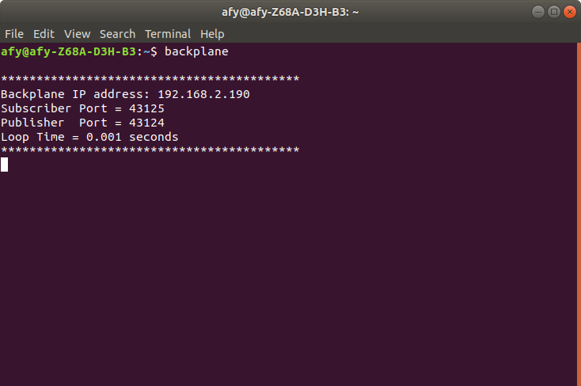
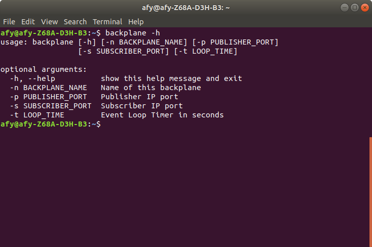
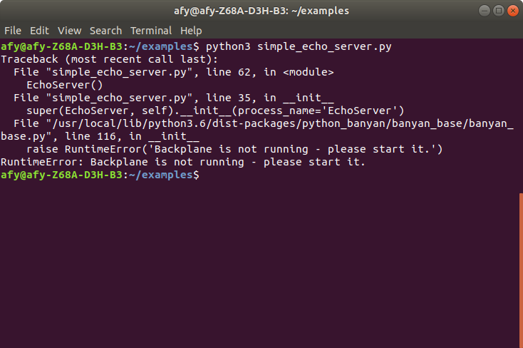

# Learn By Example
The tutorials included with this guide, provide samples of simple working
applications. The tutorials help to demonstrate Python Banyan's features,
 as well as the
set of utilities that are part of the [***python-banyan***](https://github.com/MrYsLab/python_banyan) package.

# The Key Elements of Python Banyan

There are two key components of the Banyan Framework, the ***backplane*** that acts as a
communication hub, and the ***Banyan Components*** where you implement your design. This section
will discuss these two elements.

# The Banyan Backplane

When you install Python Banyan, an executable file called ***backplane***,
is automatically installed on your computer. The backplane is implemented as a ZeroMQ *device*
called a [***Forwarder***](http://learning-0mq-with-pyzmq.readthedocs.io/en/latest/pyzmq/devices/forwarder.html).

When connecting to the backplane, all components utilize common, well-known IP addresses and port numbers.
As a result, routing is greatly simplified, and in most cases,
eliminates the need for maintaining a routing table.

Because a Banyan component automatically attempts to
"plug" itself into the backplane when first invoked, ***the backplane
must be started before starting any other components.***

If you forget to start backplane first, the component will raise a RunTimeError
exception.

In general, a Banyan application uses a single instance of the backplane.
However, it is possible to have multiple backplanes running in a single
application. Using multiple backplanes will be covered in a [later section](../example9/#example9/).

Since the backplane is not usually modified by the user, its code will not be discussed here, but
if you wish, you may view
[the backplane source code here](https://github.com/MrYsLab/python_banyan/blob/master/python_banyan/backplane/backplane.py).

## Starting the Backplane

To start the backplane, open a command or terminal window and type:

```
backplane
```



After starting the backplane, you will see a standard Python Banyan header for the Backplane.


The **backplane name** is displayed. The default is "Backplane," and usually, this default is accepted.
You may change it
using a [command-line option described below](#the-backplanes-command-line-options)

The backplane's **IP Address** is shown next to the backplane name. The backplane
always uses the **IP address** of the computer on which it is run and
is not user-configurable. This address is auto-discovered.

The **Subscriber and Publisher Ports** are also displayed. For applications
that will run on a single computer, the default ports should be accepted. These
values are user-configurable, in case you need to modify them.

The **Loop Time** sets the iteration time for the backplane's idle loop. Usually,
the default should be accepted, but it can be altered to fine-tune the application's
CPU utilization.

## The Backplane's Command-Line Options

To see the command-line options for the backplane type:
```
backplane -h
```



To specify a command-line option, provide the option and its parameter
value. Multiple options may be set if desired.

```
backplane -n MyBackplane -p 12345 -s 54321 -t .01
```

In the above, the parameters backplane name, the publisher port, the subscriber port,
and loop time have all been customized.

## Always Start The Backplane First

A Python Banyan component expects the backplane to be running when it is instantiated.
If you forget to start the backplane, the component will raise a RunTimeException.




# Python Banyan Base Classes

Most Python Banyan components need only to connect to a single Backplane and are built
 by inheriting from the ***banyan_base***
base class, [banyan_base.py](https://github.com/MrYsLab/python_banyan/blob/master/python_banyan/banyan_base/banyan_base.py).

If you need to create your application using multiple backplanes (a rare occurrence),
please refer to [this section](../example9/#example9/) for a discussion of the ***banyan_base_multi*** class.


## The BanyanBase Class

The methods of the BanyanBase class
are discussed in [detail](#the-banyanbase-class) below.

An "executive summary" of the methods follows:

1. **\__init__** - This method initializes the class. A derived class
often overrides this method to add additional initialization parameters
as well as being a convenient place to add subscription topics.
The Banyan event loop, called *receive_loop*, may be started within this method. If you choose
to start the *receive_loop* within \__init__, it should
be called
as the last line of the overridden
method, since a call to *receive_loop* will not return.

2. **set_subscriber_topic** - This method is usually **not** overridden and is used as-is.
This method is called for each subscription topic.

3. **publish_payload** - This method is usually **not** overridden and used as-is.
This method will format the message and send it to the backplane.

4. **receive_loop** - This method is usually **not** overridden and used as-is.
This method waits to receive messages that have topics that have been subscribed to.
When a message is received, it calls the **incoming_message_processing** method.

5. **incoming_message_processing** - This method **must** be overridden to handle incoming messages.

6. **clean_up** - This method may be overridden to add any additional clean-up for a terminating component.

To get a better understanding of the base class, let's look at the code line by line. You can skip this
section and move on to the [examples](../example1/) and return later if you need a more detailed explanation of the base class.

Lines 1 through 19 displays the license information.


```
     1	"""
     2	banyan_base.py
     3
     4	 Copyright (c) 2016-2019 Alan Yorinks All right reserved.
     5
     6	 Python Banyan is free software; you can redistribute it and/or
     7	 modify it under the terms of the GNU AFFERO GENERAL PUBLIC LICENSE
     8	 Version 3 as published by the Free Software Foundation; either
     9	 or (at your option) any later version.
    10	 This library is distributed in the hope that it will be useful,
    11	 but WITHOUT ANY WARRANTY; without even the implied warranty of
    12	 MERCHANTABILITY or FITNESS FOR A PARTICULAR PURPOSE.  See the GNU
    13	 General Public License for more details.
    14
    15	 You should have received a copy of the GNU AFFERO GENERAL PUBLIC LICENSE
    16	 along with this library; if not, write to the Free Software
    17	 Foundation, Inc., 51 Franklin St, Fifth Floor, Boston, MA  02110-1301  USA
    18
    19	"""


```

Lines 20 through 36 lists the packages required by banyan_base.py. All required packages are
automatically installed when the Python Banyan distribution is first installed.

Note that lines 25 through 27 are commented out.
A template for creating command-line options for your component is provided at the bottom of the file.
This is totally optional, but if you wish to use the template, you will need to uncomment outlines 25 through 27.

The template will be discussed at the [end of this discussion](#a-template-for-component-command-line-options).

```
    20	from __future__ import unicode_literals
    21
    22	# Use argparse and signal if you wish to implement the argparse
    23	# code located at the bottom of this file.
    24
    25	# import argparse
    26	# import signal
    27	# import sys
    28
    29	import socket
    30	import time
    31	import umsgpack
    32	import msgpack
    33	import msgpack_numpy as m
    34	import zmq
    35	import psutil
    36

```

Line 38 declares the BanyanBase class. It inherits from *object* to keep the class Python 2 compatible.

Lines 41 through 49 provide a brief description of the class.

Line 53 shows the import line used to import this class into your component.
The examples will demonstrate how to import BanyanBase.


```
    37
    38	class BanyanBase(object):
    39	    """
    40
    41	    This is the base class for all Python Banyan components,
    42	    encapsulating and acting as an abstraction layer for zeromq and message pack
    43	    functionality.
    44
    45	    Banyan components are derived by inheriting from this class and
    46	    overriding its methods as necessary.
    47
    48	    Banyan components have the capability to both publish and subscribe to user
    49	    defined messages using the Banyan backplane.
    50
    51	    To import into  the derived class use:
    52
    53	           from python_banyan.banyan_base import BanyanBase
    54
    55	    """
```


The base class consists of 6 methods, and the following is a discussion of each of the
methods.

## \__init__
The \__init__ method is overwritten as needed. A subscription to specific topics is
often established in this method by calling [set_subscriber_topic](#set_subscriber_topic)
for each topic.

```
    57	    def __init__(self, back_plane_ip_address=None, subscriber_port='43125',
    58	                 publisher_port='43124', process_name='None', loop_time=.1, numpy=False,
    59	                 external_message_processor=None, receive_loop_idle_addition=None,
    60	                 connect_time=0.3):
    61	        """
    62	        The __init__ method sets up all the ZeroMQ "plumbing"

```

Line 57 through 59 constitutes the parameter list for the \__init__ method.
Notice that all of the parameters contain default values, and in most cases accepting the defaults
is all that you need.

Lines 63 through 83 documents the parameters (and are discussed below).

### back_plane_ip_address
The default for this parameter is *None*. The component will discover the IP
address of the local computer and assume that the backplane is also running on this
computer. If the component is running on a computer different from the one that the backplane is running,
then this parameter will need to match the IP address of the backplane.

```
    64	        :param back_plane_ip_address: banyan_base back_planeIP Address -
    65	                                      if not specified, it will be set to the
    66	                                      local computer.
```

### subscriber and publisher ports
These are default IP ports dictated by those set for the backplane. Normally the
defaults are accepted. However, they may be modified if there are any port conflicts, or if you are running in a system
that has more than one backplane running on a computer.


```
    68	        :param subscriber_port: banyan_base back plane subscriber port.
    69	               This must match that of the banyan_base backplane
    70
    71	        :param publisher_port: banyan_base back plane publisher port.
    72	                               This must match that of the banyan_base backplane.
    73
```

### process_name
This sets the name shown in the component's console header for identification purposes. If not set,
the name of the component will be 'None'.

```
    74	        :param process_name: Component identifier in banner at component startup.
    75
```

### loop_time

A Banyan component continuously checks for any incoming messages. If no messages are available,
then the component will sleep for the specified loop time. The smaller the number,
the greater the CPU utilization for the component.

```
    76	        :param loop_time: Receive loop sleep time.
    77
```

### numpy
If the component requires numpy data handling,
then set this parameter to *True* to serialize the data efficiently.

```
    78	        :param numpy: Set true if you wish to include numpy matrices in your messages.
    79
```

### external_message_processor
Normally all incoming messages are handled within the Banyan component itself. If specified, message processing
will be done outside of the component and act similarly to a callback.

```
    80	        :param external_message_processor: external method to process messages
    81
```

### receive_loop_idle_addition
Normally the receive idle loop is executed when no messages are present.
If you wish to perform some additional processing during
idle time, set this parameter to the function or method that you would like to be called.
The function or method should be non-blocking.

```
    82	        :param receive_loop_idle_addition: an external method called in the idle section
    83	                                           of the receive loop
    84	        """
```

### connect_time
This parameter allows for the connection between the component and backplane to complete.
It prevents a race condition from occurring when trying to publish a message before the connection to the backplane
has been established.

    85	        :param connect_time: a short delay to allow the component to connect to the backplane


The actual class code for the method follows the parameter documentation strings.

Line 89 allows for the possibility of multiple inheritance.
 An example might be the need to import the *threading* module in addition to BanyanBase.

```
    88	        # call to super allows this class to be used in multiple inheritance scenarios when needed
    89	        super(BanyanBase, self).__init__()
    90

```

Line 91 declares a flag which is set when the check for a running backplane takes place.

Lines 93 through 97 assign the input parameters to instance variables.


```
    91	        self.backplane_exists = False
    92
    93	        self.back_plane_ip_address = None
    94	        self.numpy = numpy
    95	        self.external_message_processor = external_message_processor
    96	        self.receive_loop_idle_addition = receive_loop_idle_addition
    97	        self.connect_time = connect_time
```

Lines 99 through 101 are used to enable the [numpy version of messagepack](https://github.com/lebedov/msgpack-numpy) if the
numpy parameter was set to True.
```
    99	        # if using numpy apply the msgpack_numpy monkey patch
   100	        if numpy:
   101	            m.patch()

```

Lines 103 through 105 set the IP address for the backplane if one was specified.

If no backplane IP address was specified, Lines 107 through 121 checks to
see if there is a backplane currently running.
If a backplane is running, the *self.backplane_exists* flag is set to True.

**NOTE:** When the backplane is running on a remoter computer, the local component
cannot detect the presence of the remote backplane. Thus, in this case,
it is the user's responsibility to check for a running remote backplane.


```
   103	        # If no back plane address was specified, determine the IP address of the local machine
   104	        if back_plane_ip_address:
   105	            self.back_plane_ip_address = back_plane_ip_address
   106	        else:
   107	            # check for a running backplane
   108	            for pid in psutil.pids():
   109	                p = psutil.Process(pid)
   110	                try:
   111	                    p_command = p.cmdline()
   112	                except psutil.AccessDenied:
   113	                    # occurs in Windows - ignore
   114	                    continue
   115	                try:
   116	                    if any('backplane' in s for s in p_command):
   117	                        self.backplane_exists = True
   118	                    else:
   119	                        continue
   120	                except UnicodeDecodeError:
   121	                    continue

```


Lines 123 through 124 checks to see if a local backplane was found.
If not, a RunTimeError is raised. If a backplane was detected as running, lines 125 through  129 retrieve the IP address of
the local computer
and then sets the backplane_ip_address to that address.

Lines 131 through 134 continue setting instance variables from input parameters
received by the \__init__ method.


```
   123	            if not self.backplane_exists:
   124	                raise RuntimeError('Backplane is not running - please start it.')
   125	            # determine this computer's IP address
   126	            s = socket.socket(socket.AF_INET, socket.SOCK_DGRAM)
   127	            # use the google dns
   128	            s.connect(('8.8.8.8', 0))
   129	            self.back_plane_ip_address = s.getsockname()[0]
   130
   131	        self.subscriber_port = subscriber_port
   132	        self.publisher_port = publisher_port
   133
   134	        self.loop_time = loop_time

```

Lines 136 through 141 print out the standard Python Banyan console heading. It includes
the *process_name*, *backplane_ip_address*, *subscriber_port*, *publisher_port*, and *loop_time*.

```
   136	        print('\n************************************************************')
   137	        print(process_name + ' using Back Plane IP address: ' + self.back_plane_ip_address)
   138	        print('Subscriber Port = ' + self.subscriber_port)
   139	        print('Publisher  Port = ' + self.publisher_port)
   140	        print('Loop Time = ' + str(loop_time) + ' seconds')
   141	        print('************************************************************')
   142
```

Lines 143 through 151 establish ZeroMQ publish and subscribe connections to the backplane.

Line 154 calls *time.sleep* to wait for the duration of the connect_time value.
 This allows for enough time for both the publisher and subscriber connections
to be established.

```
   143	        # establish the zeromq sub and pub sockets and connect to the backplane
   144	        self.my_context = zmq.Context()
   145	        self.subscriber = self.my_context.socket(zmq.SUB)
   146	        connect_string = "tcp://" + self.back_plane_ip_address + ':' + self.subscriber_port
   147	        self.subscriber.connect(connect_string)
   148
   149	        self.publisher = self.my_context.socket(zmq.PUB)
   150	        connect_string = "tcp://" + self.back_plane_ip_address + ':' + self.publisher_port
   151	        self.publisher.connect(connect_string)
   152
   153	        # Allow enough time for the TCP connection to the Backplane complete.
   154	        time.sleep(self.connect_time)
   155
```

## set_subscriber_topic
This method is not typically overridden.

Line 156 defines the *set_subscriber_topic* method that requires a topic string
parameter. This method must be called for each subscribed topic.

Lines 166 through 167 validate that the topic is a string. If
 the topic is not a string, then a ***TypeError*** is raised.

Line 169 encodes the topic and registers it with ZeroMQ.

```
   156	    def set_subscriber_topic(self, topic):
   157	        """
   158	        This method sets a subscriber topic.
   159
   160	        You can subscribe to multiple topics by calling this method for
   161	        each topic.
   162
   163	        :param topic: A topic string
   164	        """
   165
   166	        if not type(topic) is str:
   167	            raise TypeError('Subscriber topic must be python_banyan string')
   168
   169	        self.subscriber.setsockopt(zmq.SUBSCRIBE, topic.encode())
```

## publish_payload
This method is typically not overridden.

Line 171 defines the *publish_payload* method. It accepts two parameters,
a message ***payload*** that by convention is in the form of a Python
 dictionary. The dictionary may contain one or more key/value pairs.
 The second parameter is a message ***topic*** that must be in
 the form of a valid string.

Lines 181 through 182 validate that the topic is a string. If the topic
is not of string type, then a TypeError exception is raised.

Lines 185 through 188 select the messagepack version to use to encode
the payload for transmission across the network. If the numpy parameter
was set, then messagepack_numpy is selected for use. Otherwise, standard messagepack
is selected.

Line 190 encodes the topic for transmission across the network.

Line 191 publishes the message by calling ZeroMQ *send_multipart*.

```
   171	    def publish_payload(self, payload, topic=''):
   172	        """
   173	        This method will publish a python_banyan payload and its associated topic
   174
   175	        :param payload: Protocol message to be published
   176
   177	        :param topic: A string value
   178	        """
   179
   180	        # make sure the topic is a string
   181	        if not type(topic) is str:
   182	            raise TypeError('Publish topic must be python_banyan string', 'topic')
   183
   184	        # create python_banyan message pack payload
   185	        if self.numpy:
   186	            message = msgpack.packb(payload, default=m.encode)
   187	        else:
   188	            message = umsgpack.packb(payload)
   189
   190	        pub_envelope = topic.encode()
   191	        self.publisher.send_multipart([pub_envelope, message])

```

## receive_loop

```
   193	    def receive_loop(self):
   194	        """
   195	        This is the receive loop for Banyan messages.
   196
   197	        This method may be overwritten to meet the needs
   198	        of the application before handling received messages.
   199
   200	        """
   201	        while True:
   202	            try:
   203	                data = self.subscriber.recv_multipart(zmq.NOBLOCK)
   204	                if self.numpy:
   205	                    payload2 = {}
   206	                    payload = msgpack.unpackb(data[1], object_hook=m.decode)
   207	                    # convert keys to strings
   208	                    # this compensates for the breaking change in msgpack-numpy 0.4.1 to 0.4.2
   209	                    for key, value in payload.items():
   210	                        if not type(key) == str:
   211	                            key = key.decode('utf-8')
   212	                            payload2[key] = value
   213
   214	                    if payload2:
   215	                        payload = payload2
   216	                    self.incoming_message_processing(data[0].decode(), payload)
   217	                else:
   218	                    self.incoming_message_processing(data[0].decode(), umsgpack.unpackb(data[1]))
   219	            # if no messages are available, zmq throws this exception
   220	            except zmq.error.Again:
   221	                try:
   222	                    if self.receive_loop_idle_addition:
   223	                        self.receive_loop_idle_addition()
   224	                    time.sleep(self.loop_time)
   225	                except KeyboardInterrupt:
   226	                    self.clean_up()
   227	                    raise KeyboardInterrupt
```

This method is the Python Banyan event loop and it is typically not overridden.

Line 201 is the beginning of a forever loop.

To retrieve the next available
 message on the subscription queue, line 203 calls the ZeroMQ *recv_multipart* method with the
non-blocking flag set.

### When A Message Is Available
If a message is available, it is assigned to the *data* variable on line 203.

Line 204 checks to see if the numpy flag was set, and if it were, lines 205
through 216 are executed to handle the numpy data.
This code exists because a breaking change was added to the *messagepack_numpy*
package by its author. This code is required to handle the latest and earlier versions of
messagepack_numpy.

The decoded topic string and payload are then passed to the
[incoming_message_processing method](#incoming_message_processing)
 to process the message. Line 216 handles the case for numpy data,
and 218 for non-numpy data.

### When No Messages Are Available

When the ZeroMQ *recv_mutlipart* method is called, and no data
 is available on the subscription queue, ZeroMQ raises a ***zmq.error.Again*** exception.
 The exception handler constitutes the idle portion of the Python Banyan event loop.
 During idle time, the
*receive_loop_idle_addition* variable is checked, and if set, the method assigned to
*receive_loop_idle_addition* is called.

Within the idle loop, a  *sleep* is performed for the *loop_time* duration.
 This relinquishes control of the CPU to allow other components to run. If the user presses Control-C during the idle
loop, a KeyboardInterrupt exception is raised.


## incoming_message_processing

This method ***must*** be overridden to process the incoming messages.
The decoded topic, in the form of a string, and decoded payload,
typically in the form of a dictionary, are passed in as input parameters.

The message is typically processed within this method, but may be
 handled by
an external function or method specified by the [*external_message_processor*](#external_message_processor)
parameter.

```
   229	    def incoming_message_processing(self, topic, payload):
   230	        """
   231	        Override this method with a custom Banyan message processor for subscribed messages.
   232
   233	        :param topic: Message Topic string.
   234
   235	        :param payload: Message Data.
   236	        """
   237	        if self.external_message_processor:
   238	            self.external_message_processor(topic, payload)
   239	        else:
   240	            print('this method should be overwritten in the child class', topic, payload)
```

## clean_up

This method may be overridden. It is normally called before terminating the component.
It closes both the publisher and subscriber connections and terminates the
ZeroMQ session for the component. You may add any additional clean-up that your component may require.
```
   242	    def clean_up(self):
   243	        """
   244	        Clean up before exiting - override if additional cleanup is necessary
   245
   246	        """
   247	        self.publisher.close()
   248	        self.subscriber.close()
   249	        self.my_context.term()
```

# A Template For Component Command-Line Options

If you would like to provide the facility to specify command-line options
for a component, the following is a template to do so.

This will be explained in detail in a [later section](../example2).
```
   251	# When creating a derived component, replicate the code below and replace
   252	# banyan_base with a name of your choice.
   253
   254	# def banyan_base():
   255	#     # Allow user to bypass the IP address auto-discovery.
   256	#     # This is necessary if the component resides on a computer
   257	#     # other than the computing running the backplane.
   258	#
   259	#     parser = argparse.ArgumentParser()
   260	#     parser.add_argument("-b", dest="back_plane_ip_address", default="None",
   261	#                         help="None or IP address used by Back Plane")
   262	#
   263	#     # allow the user to specify a name for the component and have it shown on the console banner.
   264	#     # modify the default process name to one you wish to see on the banner.
   265	#     # change the default in the derived class to set the name
   266	#     parser.add_argument("-n", dest="process_name", default="YOUR PROCESS NAME", help="Set process name in banner")
   267	#
   268	#     parser.add_argument("-t", dest="loop_time", default=".1", help="Event Loop Timer in seconds")
   269	#
   270	#     args = parser.parse_args()
   271	#     kw_options = {}
   272	#
   273	#     if args.back_plane_ip_address != 'None':
   274	#         kw_options['back_plane_ip_address'] = args.back_plane_ip_address
   275	#
   276	#     kw_options['process_name'] = args.process_name
   277	#
   278	#     kw_options['loop_time'] = float(args.loop_time)
   279	#
   280	#     # replace with the name of your class
   281	#     app = BanyanBase(**kw_options)
   282	#
   283	#     # optionally add any subscriber topics here
   284	#     app.set_subscriber_topic('python_banyan')
   285	#
   286	#     # optionally start the receive loop here or start it in your __init__
   287	#     try:
   288	#         app.receive_loop()
   289	#     except KeyboardInterrupt:
   290	#         sys.exit()
   291	#
   292	#     # signal handler function called when Control-C occurs
   293	#     # noinspection PyShadowingNames,PyUnusedLocal,PyUnusedLocal
   294	#     def signal_handler(signal, frame):
   295	#         print("Control-C detected. See you soon.")
   296	#         app.clean_up()
   297	#         sys.exit(0)
   298	#
   299	#     # listen for SIGINT
   300	#     signal.signal(signal.SIGINT, signal_handler)
   301	#     signal.signal(signal.SIGTERM, signal_handler)
   302	#
   303	#
   304	# if __name__ == '__main__':
   305	#     # replace with name of function you defined above
   306	#     banyan_base()

```


# The Examples

In the next section, we will begin using the hands-on demos to understand
how to build and use Python Banyan components.

## Where To Find The Example Source Code

The code for all the examples may be found on [GitHub](https://github.com/MrYsLab/python_banyan/tree/master/examples).

<br>
<br>
Copyright (C) 2017-2020 Alan Yorinks All Rights Reserved
