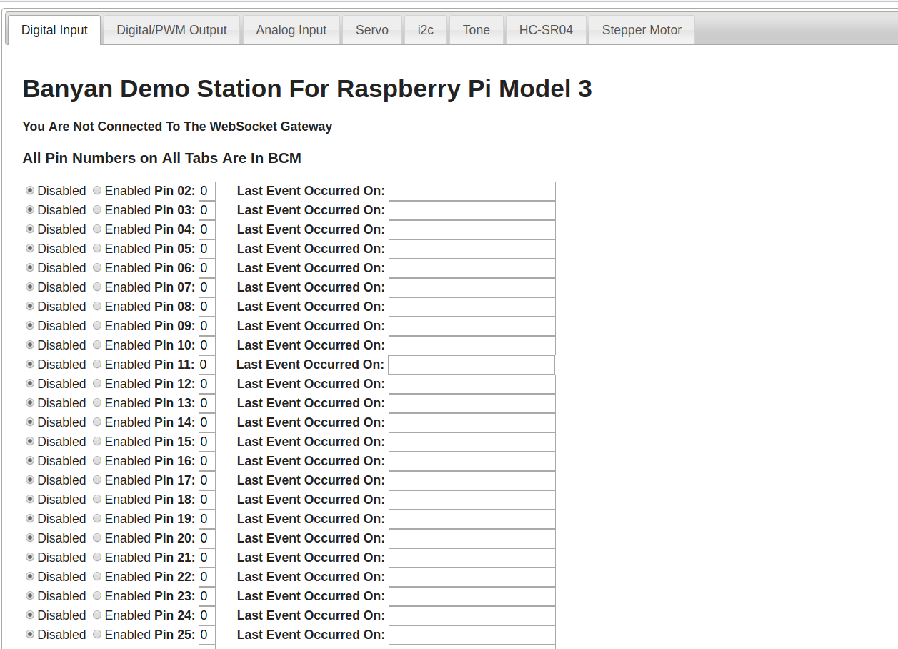

Introducing OneGPIO

***OneGPIO*** is a generalized GPIO specification and framework that will allow you to quickly construct 
GPIO based
*projects* that are both *target hardware* 
and *computer language* independent. This independence is
accomplished by taking advantage of 
the 
abstract nature of the [OneGPIO message set](https://github.com/MrYsLab/python_banyan/blob/master/projects/OneGPIO/message_specification/OneGPIO.pdf)
and the [Python Banyan Framework.](../users_guide/)
 
A OneGPIO project is typically comprised of 2 main elements - a single OneGPIO Application
Component, and one or more OneGPIO Gateways. The application component is unique for each project,
and the Gateways are reusable components that need no modification when going from one project to
 another. 

The Application Component contains all the GPIO control logic for your application,
as well as the logic to process report messages sent from the target hardware. It performs its
control duties by assembling and publishing OneGPIO control
messages, ultimately to be consumed by one or more OneGPIO
Gateways, and by subscribing to receive OneGPIO report messages sent by the OneGPIO Gateways
on behalf of the target hardware.

Once you have a OneGPIO project functional for a specific target hardware set, you may run that project
on different target hardware just by enabling the OneGPIO gateway for that target - no code changes
needed. 

Included with this distribution are several demonstration applications that use
a single OneGPIO application component (or a variation of that component) to control
Arduino, ESP-8266, and Raspberry Pi targets. 

For those in a hurry to see OneGPIO in action, you can skip to 
the [demonstration section of this document.](../one_gpio_demos/)

## "Standard" Function Call GPIO API Libraries

GPIO API libraries, such as [*pigpio*](http://abyz.me.uk/rpi/pigpio/) 
and [*Gpiozero*](https://gpiozero.readthedocs.io/en/stable/) 
(supporting the Raspberry Pi), and
[*pymata-express*](https://mryslab.github.io/pymata-express/), 
(supporting the Arduino), all provide software abstractions for GPIO
control. All of these libraries are written in Python and use function
or method calls to implement the API. 

Using any of these libraries essentially result in the same
electrical outcomes, but they have widely differing syntax structures.

For example, if we wish to take advantage of PWM functionality to set an LED's 
illumination level or a motor's speed, 
we might utilize a specific GPIO API library.

The table below illustrates the PWM API interface for the three libraries mentioned
above.

|      GPIO Operation      |              pigpio             |      Gpiozero     |     pymata-express     |
|------------------------|-------------------------------|-----------------|----------------------|
| Set Pin To PWM Mode      | pi.set_mode(PIN, pigpio.OUTPUT) | led = PWMLED(PIN) | set_pin_mode_pwm(PIN)  |
| Set PWM Pin Value To 50% | pi.set_PWM_dutycycle(PIN, 128)  |  led.value = 0.5  | analog_write(PIN, 128) |

As you can plainly see, each library has its own unique way of expressing GPIO operations.

Because of the syntax differences, it makes
porting a hardware project from one hardware platform to another,
a laborious and tedious process, not to mention being error prone and time consuming.
It also severely hampers the possibility of code reuse for future projects.

## The Banyan OneGPIO API

OneGPIO takes advantage of the portable nature of Banyan protocol messages to
provide a unified GPIO API. In addition to the OneGPIO GPIO message specification,
the OneGPIO concept specifies a framework for building specialized Banyan components,
 called Banyan GPIO Gateways. These specialized components translate 
OneGPIO messages to and from a specific hardware platform. The OneGPIO project
includes fully functional Banyan Gateways for the Arduino, 
ESP-8266 and Raspberry Pi.

A single OneGPIO control component can control a single hardware target, or
multiple targets simultaneously without any code changes. 

All OneGPIO Gateways
are derived from a Gateway Base class making it easy to create new
Banyan Gateways. 

You may use the included [OneGPIO Gateways](../banyan_gateways/) as is, 
or you may easily customize them to meet your
specific needs.

In the following sections we will:

* Discuss the OneGPIO messaging protocol
* Discuss Banyan OneGPIO Gateway internals
* Discuss the included demonstration programs
    * Demonstrate a single OneGPIO Application Component that can blink an LED on an Arduino, ESP-8266, or Raspberry Pi
    * Demonstrate how a single OneGPIO tkinter Application Component is able to control
a Raspberry Pi, Arduino and ESP-8266

    

    * Demonstrate a Banyan WebSocket gateway that allows an HTML web page to control
any of the 3 hardware platforms

