# Introduction To The Demos


This section will introduce three demonstration programs that control the Arduino, 
ESP-8266, and Raspberry Pi hardware targets, using common OneGPIO Application Components.


The demo programs included are:

1. An LED blink program.
2. A Tkinter GPIO Demonstration Station.
3. A Web-based GPIO Demonstration Station.

A single OneGPIO Application Component is provided for the blink demo
and one for the Tkinter demo, each containing the
GPIO control logic to run their respective demos.

 For the Web Demonstration
stations, the logic is coded in JavaScript within the Web page. The Web page
connects to the Banyan network through the 
[WebSocket Gateway.](../additional_gateways/#websocket-gateway)
OneGPIO formatted messages are JSON encoded on the Webpage and then sent to the
WebSocket Gateway.


## Prerequisites

### All Hardware Platforms

Make sure that you have the newest version of
[***python-banyan***](../install/#installing-python-banyan_1) on your computer.
You can upgrade to the latest version using the [pip *--upgrade* option.](https://packaging.python.org/tutorials/installing-packages/#upgrading-packages)

In addition to installing Python Banyan, you will need to download the 
latest python-banyan distribution files to your computer to run the demos.  To download,
go to the [Python Banyan Github Web page](https://github.com/MrYsLab/python_banyan) and
click on the green download button and unzip to any directory.

All of the demos may be launched manually, that is, bringing up each component
individually. However, it is much simpler to use the Banyan Launcher, and therefore we will
use it to launch each demo. To review the information about the launcher, 
[click on this link.](../example8/) 

The Banyan launcher is automatically installed as an executable when you install
the python-banyan distribution.


The launcher requires a command-line option to load a Launcher specification file. Launcher
specification files have been provided for each demo and for each platform. Modifications
that you may need to be made to these files will be covered in each demo section.

#### Python 3.7

Both the Arduino Gateway and WebSocket Gateway requires the use of Python 3.7 or higher.

You may install and manage multiple versions of Python by using [pyenv.](https://realpython.com/intro-to-pyenv/)

With pyenv, you can set a specific directory
to use the latest version of Python by using the pyenv *local* command.  You may
also  create a virtual environment for a given
directory
using *pyenv virtualenv*.

Again, this will all be accomplished via the Banyan launcher and will be covered in the [Web Demonstration Station section of this document for
the Raspberry Pi.](../one_gpio_demos/#banyan-demonstration-station-web-pages)


Since the Windows Operating System is not dependent upon Python, it is probably
easiest to install the latest version of Python3 on your computer from
python.org(https://www.python.org/).


### Arduino


The Arduino Gateway was implemented using the ***python-express*** GPIO library.
Install [***python-express***](https://mryslab.github.io/pymata-express/install_pymata_express/)
 on your computer and [***firmata-express***](https://mryslab.github.io/pymata-express/firmata_express/)
on your Arduino.

### ESP-8266

A NodeMCU ESP-8266 development module was used to test the demo programs.
AA custom MicroPython script was developed to work with the 
ESP-8266 Gateway, and this script must be installed on the ESP-8266.  It and may be found
[here.](https://github.com/MrYsLab/python_banyan/blob/master/projects/OneGPIO/esp_8266/esp_8266.py)
 
This script is a "minified" version to allow it to fit on the device. A fully commented file
is provided [here.](https://github.com/MrYsLab/python_banyan/blob/master/projects/OneGPIO/esp_8266/esp_8266_micropython/esp_8266Full.py)

It is assumed that you already know how to flash a program onto the ESP-8266. 
If you need some information on flashing the ESP-8266, the program I use to manage ESP-8266 image files is [Adafruit Ampy.](https://learn.adafruit.com/micropython-basics-load-files-and-run-code/install-ampy)
The Ampy Web page says that only CircuitPython is supported. But you can ignore that warning and use it to
install the OneGPIO MicroPython script.

The ampy command-line I use is: **ampy -p /dev/ttyUSB0 put esp_8266.py**

You will need to re-power the board after flashing. The red LED should 
flash and then stay lit. It will extinguish when the board
successfully connects to the ESP-8266 OneGPIO Gateway.

**NOTE:** You will need to know the TCP/IP address of your ESP-8266
and present that as a command-line argument to the ESP-8266 Gateway.


### Raspberry Pi
The Raspberry Pi has no additional requirements unless you wish to
install Python 3.7. The demos were tested with *"Raspbian Stretch with desktop and recommended software,"*
with a release date of 2019-04-08. 

If you are running the demos within a pyenv Python 3.7 or higher virtual environment,
the Raspberry Pi Gateway may not be able to import pigpio.
To test this out, when in the virtual environment, start-up Python and type *import pigpio.*
 


```
pi@RPi3:~ $ cd 37*
(python-banyan) pi@RPi3:~/37stuff $ python
Python 3.7.3 (default, Apr 26 2019, 09:58:44) 
[GCC 6.3.0 20170516] on linux
Type "help", "copyright", "credits" or "license" for more information.
>>> import pigpio
>>> 

```
If no errors are reported, you are good to go. 
If you see an import error, you will need to manually move a copy of pigpio.py to the virtual environment.

If you are using the version of pigpio included with the Raspbian distribution,
you can find pipgio.py in the /usr/lib/python3/dist-packages/ directory.

If you rebuilt pigpio to use the latest version, then you can find the pigpio.py
file in the PIGPIO directory that was created during the build process. 

The pigpio.py file needs to be copied to a directory in the ~/.pyenv directory. For my pyenv virtual environment, I used Python 3.7.3 and named
the virtual environment python_banyan. I needed to copy the file to:

~/.pyenv/versions/3.7.3/python-banyan/lib/python3.7/site-packages/

Here is the general template for this path:

~/.pyenv/versions/PYTHON VERSION/VIRTUAL ENVIRONMENT NAME/lib/PYTHON VERSION WITHOUT LAST NUMBER/site-packages/


## The Demo Examples

All of the demos are launched using the Banyan Launcher. The launcher specification files utilize a relative
path to access the components for the applications. As a result, you must
maintain the directory structure of the python-banyan distribution. If you haven't downloaded
the distribution yet, you may do so by
clicking on the green download button found on [this link](https://github.com/MrYsLab/python_banyan)
 and then unzip the files.

The launcher files may be found in the 
[projects/OneGPIO/launch_scripts](https://github.com/MrYsLab/python_banyan/tree/master/projects/OneGPIO/launch_scripts)
directory or the 
[projects/OneGPIO/launch_scripts_for_windows](https://github.com/MrYsLab/python_banyan/tree/master/projects/OneGPIO/launch_scripts_for_windows)
directory. 

You will find the Banyan Launcher specification files used for each 
demonstration and for each hardware target in those directories.

The difference between the Windows and non-Windows specifications files is that the command
to invoke python is different. Windows uses ***python***, while the other platforms use ***python3.***


The specification files are csv (comma-separated value) files. They may need to be modified
for your specific environment. Those modifications will be discussed within the discussions for each specific
demonstration.


### Blink Demo


You can view the source code for the 
[blink demo here.](https://github.com/MrYsLab/python_banyan/blob/master/projects/OneGPIO/shared/blinker.py)


#### Running The Blink Demo On The Arduino

To run this demo for the Arduino, you must use Python 3.7 or higher, as mentioned above.

Let's look at the [b_a.csv](https://github.com/MrYsLab/python_banyan/blob/master/projects/OneGPIO/launch_scripts/b_a.csv) launcher specification file in the launch_scripts directory.

```
command_string,spawn,topic,append_bp_address,auto_restart,wait
python3 ../arduino_uno/arduino_gateway.py,no,local,no,no,5
python3 ../shared/blinker.py -g 10,no,local,no,no,0
```

The default hardware target for blinker.py is the Arduino, and therefore we do not need
to specify it here.

The only change you may need to make is on the third line, the **-g** option. This option sets the pin
number for the connected LED. The default is set to 10 - modify this value to meet your needs.

To run this demo:

1. Plug the Arduino into your computer.
2. Go into the launch_scripts directory and type:

```
bls -f b_a.csv
```

The bls command starts the Banyan Launcher server, and the -f option instructs bls
to load the b_a.csv specification file.

When you hit return, everything needed to run this demo will be loaded, and you should see
the LED on the pin you specified blink.

#### Running The Blink Demo On The ESP-8266

Let's look at the [b_e.csv](https://github.com/MrYsLab/python_banyan/blob/master/projects/OneGPIO/launch_scripts/b_e.csv) launcher specification file in the launch_scripts directory.

```
command_string,spawn,topic,append_bp_address,auto_restart,wait
python3 ../esp_8266/esp8266_gateway.py -i 192.168.2.183,no,local,no,no,0
python3 ../shared/blinker.py -d esp8266 -g 13,no,local,no,no,0
```
There are 2 changes you may need to make for this file. The first is the IP address of the computer
that the esp8266_gateway is running on. This is specified with the **-i** option on the second line. For my
environment, that address is 192.168.2.183, but yours is likely to be different.

The second change you may need to make is on the third line, the **-g** option. This option sets the pin
number for the connected LED. The default is set to 13 - modify this value to meet your needs. The blinker.py
script also needs to have the target hardware type defined using the -d option. 

To run this demo:

1. Power up the ESP-8266.
2. Go into the launch_scripts directory and type:

```
bls -f b_e.csv
```

The bls command starts the Banyan Launcher server, and the -f option instructs bls
to load the b_e.csv specification file.

When you hit return, everything needed to run this demo will be loaded, and you should see
the LED on the pin you specified blink.


#### Running The Blink Demo On The Raspberry Pi

The [Raspberry Pi Gateway](https://github.com/MrYsLab/python_banyan/blob/master/projects/OneGPIO/raspberry_pi/rpi_gateway.py)
utilizes the [pigpio API library.](http://abyz.me.uk/rpi/pigpio/python.html)

When the Raspberry Pi Gateway is invoked, it will check to see if the pigpio daemon is currently running.
If not, it will automatically start it. The pigpio library may report an error, as shown
in this screenshot.

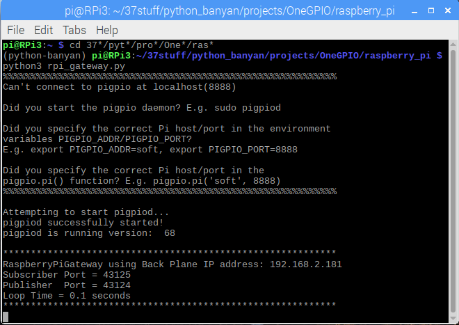


It can safely be ignored since the gateway will automatically start
the daemon. The daemon will continue running even after the gateway is closed.

Let's look at the [b_r.csv](https://github.com/MrYsLab/python_banyan/blob/master/projects/OneGPIO/launch_scripts/b_r.csv) launcher specification file in the launch_scripts directory.

```
command_string,spawn,topic,append_bp_address,auto_restart,wait
python3 ../raspberry_pi/rpi_gateway.py,no,local,no,no,0
python3 ../shared/blinker.py -d rpi -g 4,no,local,no,no,0
```
The only change you may need to make is on the third line, the **-g** option. This option sets the pin
number for the connected LED. The default is set to 4 - modify this value to meet your needs.


To run this demo:

1. Power up the Raspberry Pi.
2. Go into the launch_scripts directory and type:

```
bls -f b_r.csv
```

The bls command starts the Banyan Launcher server, and the -f option instructs bls
to load the b_r.csv specification file.

When you hit return, everything needed to run this demo will be loaded, and you should see
the LED on the pin you specified blink.

## Tkinter Demo Station

The Tkinter Demo Station is a GUI application that will allow you to remotely interact with the target hardware. 
 A common python script,
[banyan_tkinter_demo.py,](https://github.com/MrYsLab/python_banyan/blob/master/projects/OneGPIO/shared/blinker.py)
is used for all three targets and is a OneGPIO Application Component. The target type is supplied as a command-line parameter when
invoking banyan_tkinter_demo. This is provided in each of the launcher specification files.


### Tkinter Demo Station Functions

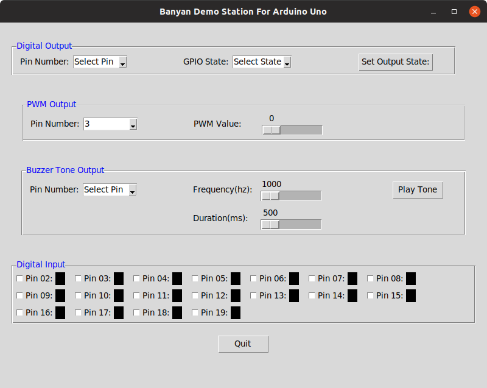


The Tkinter Demo Station for the Arduino is shown above. No matter the target hardware, the
Tkinter Demo Station for all target hardware types share common capabilities.

#### Digital Output Control

The Tkinter Demo Station allows you to set the state of a digital output pin. To use this feature, you first select the pin number, 
then the pin's output value, and finally, you set the state by pressing the **Set Output State** button.

#### PWM Output Control

To set a PWM output pin, first, select the pin number and then use the slider to set its output value.

#### Buzzer Tone Control

Select the pin, then set the frequency in HZ and duration in milliseconds for the tone. Press the **Play Tone**
button to generate the tone.

#### Digital Input

Select and enable digital input for a pin by clicking on the white box to the left of the pin number.
The box to the pin number's right will be black if the pin value is zero and red if it is a one. 
If a pin is enabled for digital input, its current state will be shown in real-time.


### Running The Tkinter Demonstration Station For Arduino

Let's look at the [tk_a.csv](https://github.com/MrYsLab/python_banyan/blob/master/projects/OneGPIO/launch_scripts/tk_a.csv) launcher specification file in the launch_scripts directory.

```
command_string,spawn,topic,append_bp_address,auto_restart,wait
python3 ../arduino_uno/arduino_gateway.py,no,local,no,no,4
python3 ../shared/banyan_tkinter_demo.py -d arduino,no,local,no,no,0
```
You should not have to make any changes to this specification file.


To run this demo:

1. Connect the Arduino to your computer.
2. Go into the launch_scripts directory and type:

```
bls -f tk_a.csv
```

The bls command starts the Banyan Launcher server, and the -f option instructs bls
to load the tk_a.csv specification file.

You should see a Tkinter window for the Arduino appear.


### Running The Tkinter Demonstration Station For The ESP-8266

Let's look at the [tk_e.csv](https://github.com/MrYsLab/python_banyan/blob/master/projects/OneGPIO/launch_scripts/tk_e.csv) launcher specification file in the launch_scripts directory.

```
command_string,spawn,topic,append_bp_address,auto_restart,wait
python3 ../esp_8266/esp8266_gateway.py -i 192.168.2.185,no,local,no,no,0
python3 ../shared/banyan_tkinter_demo.py -d esp8266,no,local,no,no,0
```

You most likely will have to specify the IP address of the computer that is
running the esp8266 gateway. This is done on line 2 of the file with the
**-i** option.


To run this demo:

1. Power the ESP-8266
2. Go into the launch_scripts directory and type:

```
bls -f tk_e.csv
```

The bls command starts the Banyan Launcher server, and the -f option instructs bls
to load the tk_e.csv specification file.

You should see a Tkinter window for the ESP-8266 appear.

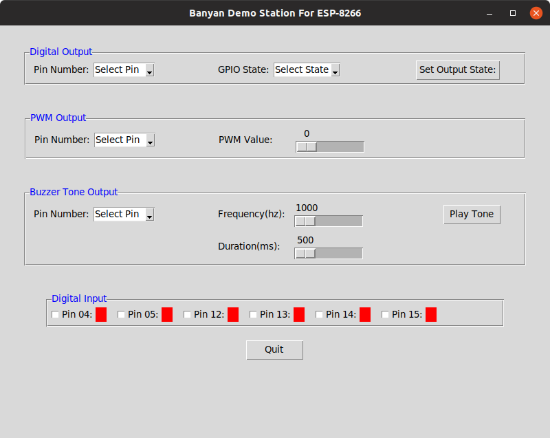


### Running The Tkinter Demonstration Station For Raspberry Pi

Let's look at the [tk_r.csv](https://github.com/MrYsLab/python_banyan/blob/master/projects/OneGPIO/launch_scripts/tk_r.csv) launcher specification file in the launch_scripts directory.

```
command_string,spawn,topic,append_bp_address,auto_restart,wait
python3 ../raspberry_pi/rpi_gateway.py,no,local,no,no,0
python3 ../shared/banyan_tkinter_demo.py -d rpi,no,local,no,no,0
```
You should not have to make any changes to this specification file.


To run this demo:

1. Power the Raspberry Pi.
2. Go into the launch_scripts directory and type:

```
bls -f tk_r.csv
```

The bls command starts the Banyan Launcher server, and the -f option instructs bls
to load the tk_r.csv specification file.

You should see a Tkinter window for the Raspberry Pi appear.

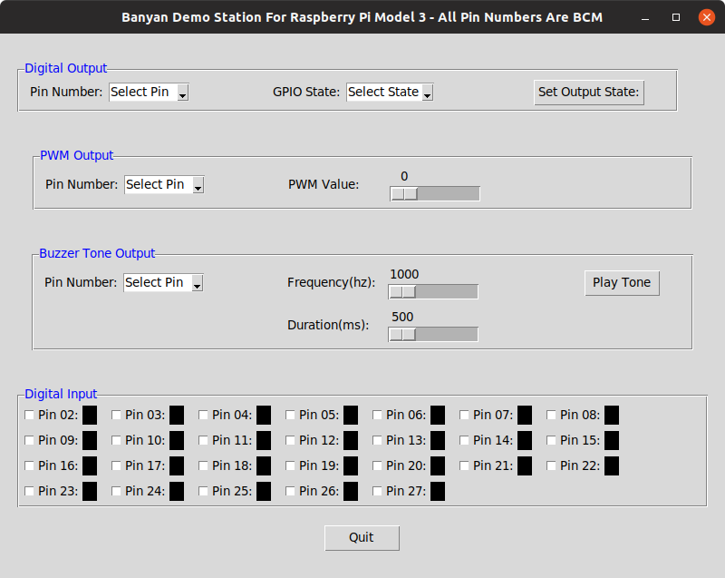


## Banyan Demonstration Station Web Pages
Once again, the Banyan launcher will be used to run Web page demos.
The launcher will start the Backplane, the Gateway for the hardware target, 
the WebSocket Gateway.  It will also start your Web browser with the correct HTML page loaded.

By clicking on the following links, you may view the HTML pages for the
[Arduino](https://github.com/MrYsLab/python_banyan/blob/master/projects/OneGPIO/arduino_uno/arduino.html),
 [ESP-8266](https://github.com/MrYsLab/python_banyan/blob/master/projects/OneGPIO/esp_8266/esp8266.html), 
 and [Raspberry Pi.](https://github.com/MrYsLab/python_banyan/blob/master/projects/OneGPIO/raspberry_pi/rpi.html)

The pages of the Demonstration Station may vary slightly between hardware targets. But
all use the OneGPIO messaging specification, allowing the target hardware gateway to
handle the messaging.

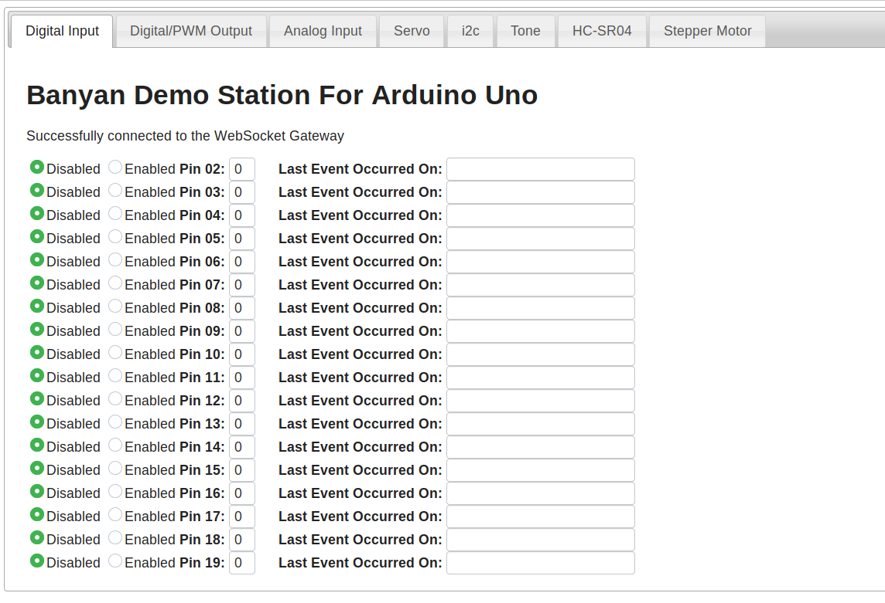


There is a common set of functions, selected by tab, for all of the targets:

1. Digital Input
2. Digital Output Including PWM
3. Analog Input
4. Servo Motor Control
5. I2C Read and Write
6. Piezo Buzzer Tone Generation
7. Monitoring of an HC-SR04 Sonar Distance Sensor
8. Stepper Motor Control


**Note** Analog Input is supported for the Raspberry Pi by using a PCF8591 A/D
i2c converter.

The digital and analog tabs will display a timestamp for the last
change to an enabled pin, and the pin's value:

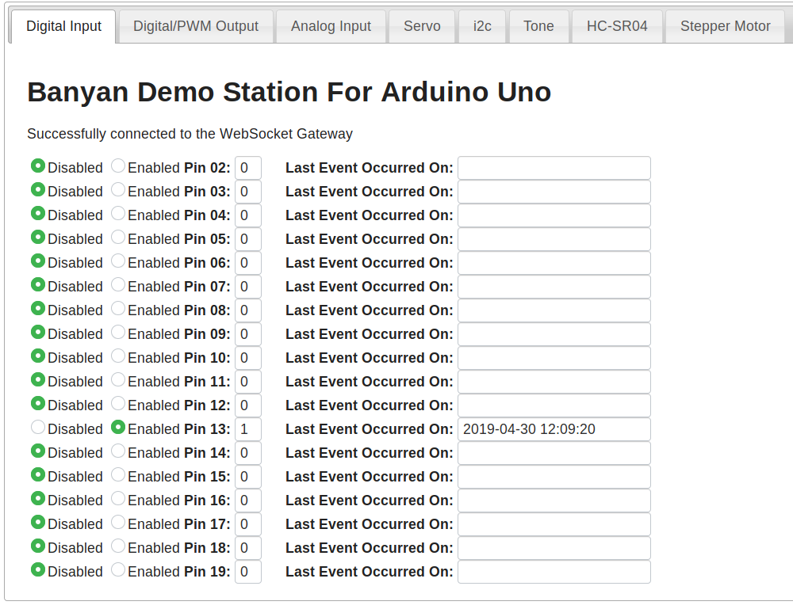

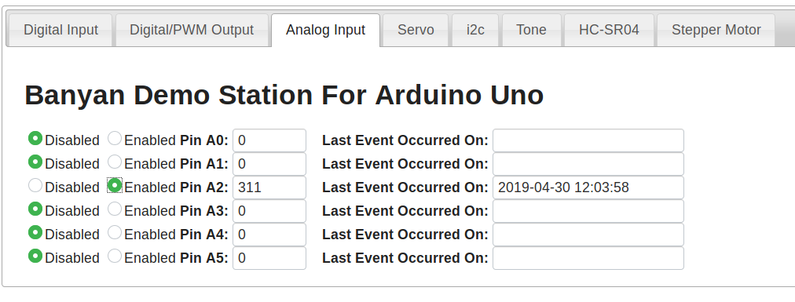


### Running The Web Demo Station For The Arduino

Let's look at the 
[h_a.csv](https://github.com/MrYsLab/python_banyan/blob/master/projects/OneGPIO/launch_scripts/h_a.csv) launcher specification file in the launch_scripts directory.

```
command_string,spawn,topic,append_bp_address,auto_restart,wait
python3 ../arduino_uno/arduino_gateway.py,no,local,no,no,5
python3 ../shared/ws_gateway.py,no,local,no,no,1
python3 ../shared/open_browser.py,no,local,no,no,5
```

You should not need to make any modifications to this file.


To run this demo:

1. Plug the Arduino into your computer
2. Go into the launch_scripts directory and type:

```
bls -f h_a.csv
```

### Running The Web Demo Station For The ESP-8266

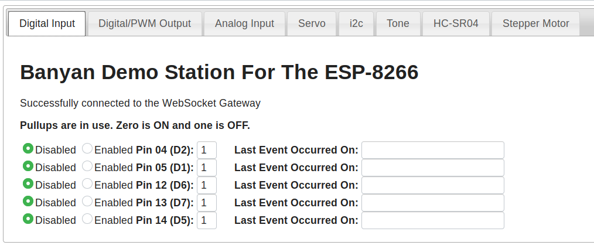


Let's look at the 
[h_e.csv](https://github.com/MrYsLab/python_banyan/blob/master/projects/OneGPIO/launch_scripts/h_e.csv) launcher specification file in the launch_scripts directory.

```
command_string,spawn,topic,append_bp_address,auto_restart,wait
python3 ../esp_8266/esp8266_gateway.py -i 192.168.2.185,no,local,no,no,4
python3 ../shared/ws_gateway.py,no,local,no,no,1
python3 ../shared/open_browser.py esp8266,no,local,no,no,5
```

You will most likely need to modify the IP address in line 2 following the 
**-i** option.


To run this demo:

1. Power the ESP-8266
2. Go into the launch_scripts directory and type:

```
bls -f h_e.csv
```


### Running The Web Demo Station For The Raspberry Pi Without Python 3.7 Installed

If you do not have Python 3.7 or higher installed on your Raspberry Pi, you may still run this demo.
Because Banyan allows us to distribute Banyan components across computers, we run
the Web server and WebSocket Gateway on our PC and the Raspberry Pi Gateway on the
Raspberry Pi.

The launcher was designed to handle these situations. First, we need to start the
Banyan Launcher Client (blc) on the Raspberry Pi using a command-line similar to this one:

```
blc -t rpi_remote -b 192.168.2.186
```

The *-t* option is a topic that will be used when the Banyan Launcher Server (bls) publishes its
launcher messages. The *-b* option is the IP address of the PC, where we will launch bls.

You will most likely have to modify the IP address when executing this command. The *topic* may be
any string as long as both bls and blc use the same string.

Here is what you will see on the Raspberry Pi after starting blc:

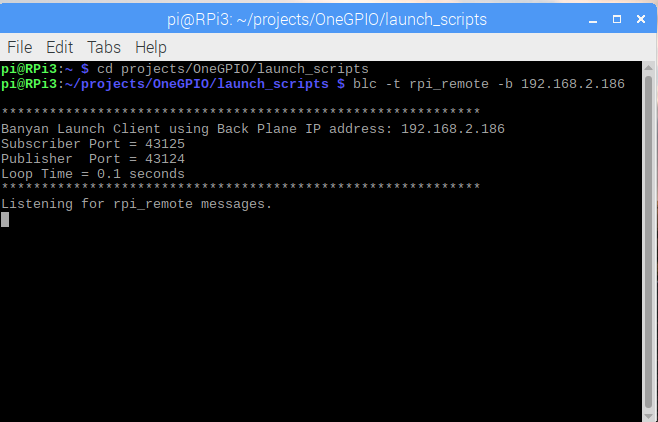

Now, let's look at the
[h_r_dist.csv](https://github.com/MrYsLab/python_banyan/blob/master/projects/OneGPIO/launch_scripts/h_r_dist.csv) launcher specification file in the launch_scripts directory.

```
command_string,spawn,topic,append_bp_address,auto_restart,wait
python3 ../raspberry_pi/rpi_gateway.py,no,rpi_remote,yes,no,5
python3 ../shared/ws_gateway.py,no,local,no,no,1
python3 ../shared/open_browser.py rpi,no,local,no,no,1
```

You should not need to make any modifications to this file.
Note that the *topic* field, in line 2, was set to **rpi_remote,** and the
*append_bp_address* field, in line 2, was to **yes.**

Now, let's start *bls* on our PC:

```
$ bls -f h_r_dist.csv

************************************************************
Banyan Launch Server using Back Plane IP address: 192.168.2.186
Subscriber Port = 43125
Publisher  Port = 43124
Loop Time = 0.1 seconds
************************************************************
backplane                           PID = 15856
python3 ../shared/ws_gateway.py     PID = 15881

************************************************************
WebSocket Gateway using Back Plane IP address: 192.168.2.186
Subscriber Port = 43125
Publisher  Port = 43124
************************************************************
python3 ../shared/open_browser.py rpi PID = 15885
ACKrpi_remote
ACKrpi_remote: python3 ../raspberry_pi/rpi_gateway.py -b 192.168.2.186 PID = 6216
```

The Web browser will be launched on the PC. 

We then check the Raspberry Pi and see that the Raspberry Pi Gateway was started:

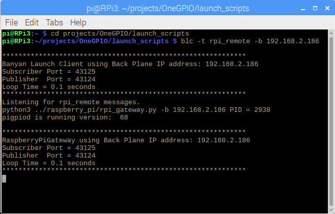


We may now start using the Web page on our PC to control the Raspberry Pi remotely.

### Killing All The Processes

To kill all the computers' processes, open another terminal window on your pc and type blk (the Banyan Launch Killer):
```
$ blk

************************************************************
Launcher Killer using Back Plane IP address: 192.168.2.186
Subscriber Port = 43125
Publisher  Port = 43124
Loop Time = 0.1 seconds
************************************************************
```

If we check the terminal window where we invoked bls, we now see:

```
$ bls -f h_r_dist.csv

************************************************************
Banyan Launch Server using Back Plane IP address: 192.168.2.186
Subscriber Port = 43125
Publisher  Port = 43124
Loop Time = 0.1 seconds
************************************************************
backplane                           PID = 10887
python3 ../shared/ws_gateway.py     PID = 10912

************************************************************
WebSocket Gateway using Back Plane IP address: 192.168.2.186
Subscriber Port = 43125
Publisher  Port = 43124
************************************************************
python3 ../shared/open_browser.py rpi PID = 10916
ACKrpi_remote
ACKrpi_remote: python3 ../raspberry_pi/rpi_gateway.py -b 192.168.2.186 PID = 2938
killall
backplane                           PID = 10887 KILLED
python3 ../shared/ws_gateway.py     PID = 10912 KILLED
python3 ../shared/open_browser.py rpi PID = 10916 KILLED
```

And now,  if we look at the terminal window on the Rasbpberry Pi where we invoked
blc, we see:

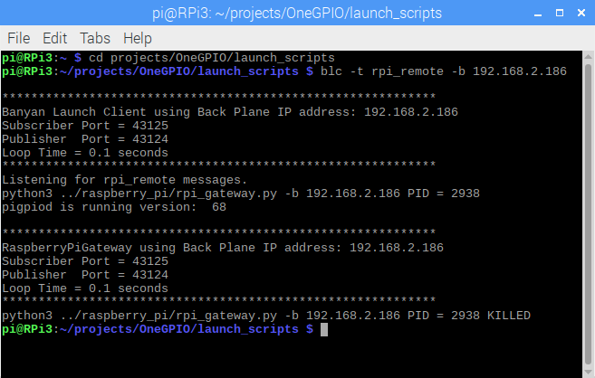

<br>
<br>
Copyright (C) 2017-2020 Alan Yorinks All Rights Reserved
